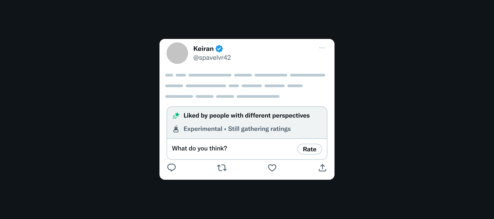

# Experimental Pilot Test: Posts liked by people with different perspectives

Community Notes show when they’re found helpful by people who normally disagree. What if we could do the same for posts, recognizing posts that are liked by people who normally disagree? We’ve heard requests for this for years since launching Community Notes, and we’re running a small, experimental pilot to test the concept.

A subset of Community Notes contributors — representing a wide range of viewpoints — will occasionally see a new callout in the product. The callout shows based on early and limited Like signals on the post. Contributors will then be able to rate and provide more feedback about the post, helping to develop an open source algorithm that could effectively identify posts liked by people from different perspectives.

If a post then receives sufficiently positive ratings — determined by an early, in-development open-source scoring algorithm — the callout will switch to indicate that the post seems to be liked by people from different perspectives. You can [see and learn more about the open-source algorithm](https://github.com/twitter/communitynotes/tree/main/liked-by-different-perspectives).

If your ratings help a note get recognized in this way, you’ll get a notification letting you know.

Contributors can also see a feed of posts with these callouts in the [Got Likes](https://x.com/i/communitynotes/got_likes) section of the Community Notes site.

Following the path we used to develop Community Notes, we’re building in public with a small pilot so that this concept can be shaped by the people. We look forward to learning and iterating with you all as we do with Community Notes every day.

### FAQ

**Who can see these callouts?**

Since this is a new concept, we’re initially pilot testing with a small set of US Community Notes contributors representing a wide range of perspectives. We expect the pilot to expand over time.

This follows the approach we took in developing Community Notes — starting with a small pilot test, expanding over time as the product developed, ultimately becoming a global product.

**What happens with ratings?**

Contributors in the pilot test will be able to rate and provide feedback, which will in turn help to develop an open source algorithm that can effectively identify posts liked by people from different perspectives. 

This follows the approach we took in developing Community Notes. During the pilot of Community Notes, ratings from pilot participants were used to help develop an open-source algorithm to identify notes that are found helpful from people with different perspectives.

**How does the open-source scoring algorithm work?**

Through this pilot test, we aim to develop an open-source algorithm that can effectively identify posts liked by people from different perspectives. We’re actively developing this algorithm during the pilot test, based on feedback from pilot contributors and others on X. 

Currently, the open-source algorithm is extremely simplistic — similar to how the early Community Notes pilot algorithms were simplistic. It looks to see whether a post has been seen by numerous people, has positive ratings, and no negative ratings. We expect this algorithm to evolve as the pilot expands. You can [see the code in Github](https://github.com/twitter/communitynotes/tree/main/liked-by-different-perspectives).

**Does this experiment affect a post’s reach or visibility in any way?**

No. Neither the existence of a callout, nor ratings, affect a post’s reach or visibility. Depending on insights and feedback from the pilot test, it is possible that in the future, ratings could help spotlight posts that are liked by people who normally disagree.

**What determines whether a callout is on a post?**

Callouts appear based on early and limited Like signals on the post. The existence of a callout does not imply that a post was in fact liked by people from different perspectives, nor does it imply that other posts are not. We expect this approach to evolve and improve over time. The aim of the pilot test is to gather feedback and develop an open-source algorithm to identify notes that are found helpful from people with different perspectives.

**How can I provide feedback?**

Feel free to DM [@CommunityNotes](https://x.com/communitynotes) and write #GotLikesFeedback at the top of your DM.
