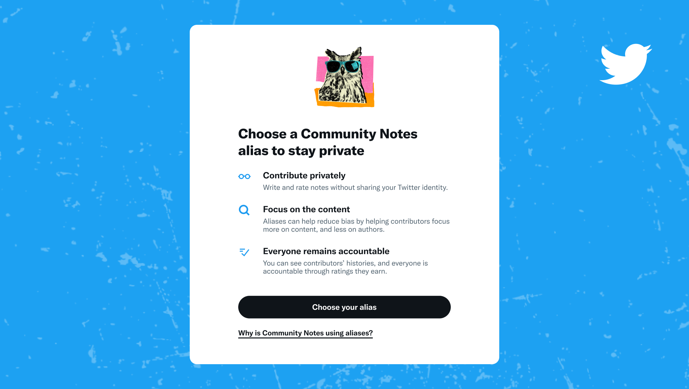
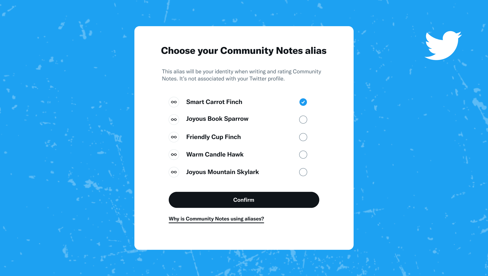

# Aliases

We want everyone to feel comfortable contributing to Community Notes. Aliases let contributors write and rate notes without sharing their X usernames.

A Community Notes alias is a new, auto-generated display name that contributors get when they join Community Notes. Aliases are not publicly associated with contributors’ X accounts, so everyone can write and rate notes privately.

Further, we believe aliases have the potential to:

- **Reduce bias**. By keeping focus on the content of notes rather than who’s writing them, aliases have the potential to reduce bias that people might have around specific authors.
- **Reduce polarization**. [Recent research](https://x.com/chris_bail/status/1379453587558952960?s=20) indicates aliases might reduce polarization by helping people feel comfortable crossing partisan lines, or criticizing their own side without the prospect of peer pressure or retribution.

### Accountability

It’s important that the benefits of aliases don’t come at the expense of accountability. To that end: all Community Notes accounts have profile pages that make it easy to see one’s past contributions and their [Writing and Rating Impact](./writing-and-rating-impact.md). Additionally, Community Notes contributors are [accountable to ratings their contributions receive](https://x.com/communitynotes/status/1404519791394758657), giving weight to contributors whose notes and ratings are consistently found helpful by others.

## How to choose your alias

Contributors can visit [this link](https://x.com/i/communitynotes/u/me) to choose an alias. You'll have 5 random options to pick from, and at this time choices cannot be changed.

## Contributor profiles

With aliases, every contributor gets a public profile. On this page, everyone can see the notes people have written in the past, as well as their [Writing and Rating Impact](./writing-and-rating-impact.md). We'll continue to add information and evolve the profile pages as we learn more about what's important to contributors when using Community Notes.

Don't hesitate to [send us feedback](http://x.com/communitynotes) at any time.
