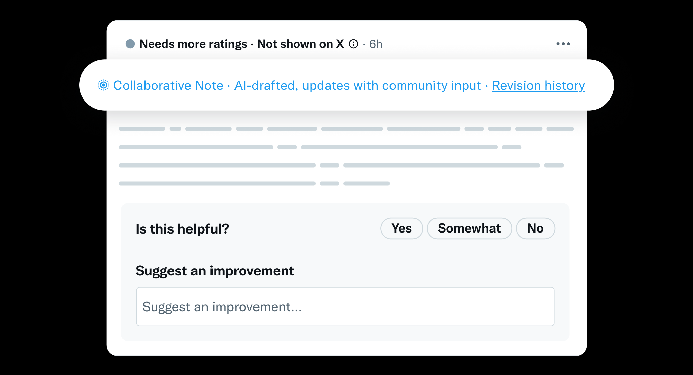

# Collaborative Notes

Collaborative Notes are a new way for the community to add context to posts. They're created when contributors request a note, and improve through suggestions and ratings from the community. They're written and updated by AI, using community input. It's new approach to the public working together with AI.

This is a new, experimental feature, and we expect it to evolve based on contributor feedback.

## How Collaborative Notes are created

Collaborative Notes are generated when contributors tap "Request a Note" on a post. This alerts other contributors (as it always has), and now also kicks off creation of a Collaborative Note. The requester is notified when the note is ready, and can rate and suggest improvements to it.

Currently, requests from [Top Writers](./top-contributors.md) on English-language posts generate Collaborative Notes. Over time, we expect to expand this so requests from more contributors generate them as well.

## How to interact with Collaborative Notes

### Rate them

Collaborative Notes can be rated just like any other Community Note. Your ratings help determine whether a Collaborative Note earns the status of Helpful and gets shown on the post.

### Suggest improvements

When rating a Collaborative Note, you can also suggest an improvement. Suggestions appear as part of the rating form — tap the same "submit" button to submit both your rating and suggestion.

Currently, suggesting improvements is available to contributors with 2+ [Writing Impact](./writing-and-rating-impact.md). Availability will likely expand over time.

To edit or delete a suggestion, edit or delete your rating on the note.

## How Collaborative Notes update

Collaborative Notes can update over time as suggestions and ratings come in. When considering an update, the system reviews new input from contributors to make the note as helpful as possible, then decides whether the new version is a meaningful improvement.

If you make a suggestion and the note gets updated, you'll be notified. You'll also be able to see whether your suggestion was incorporated, and why or why not.

### Revision history

When looking at a Collaborative Note, you can tap "Revision history" to see older versions of the note.

## How Collaborative Notes earn status

Collaborative Notes are scored like all Community Notes. If enough contributors from [different points of view](./diversity-of-perspectives.md) rate a note as helpful, it earns a status of Helpful and starts showing on X.

## Transparency

Collaborative Notes are designed with the same transparency principles as the rest of Community Notes:

- **Open-source code**: The note generation code, including prompts and logic, is [open-source](https://github.com/twitter/communitynotes)
- **Public data**: Collaborative Notes and suggestions are included in the [public data downloads](../under-the-hood/download-data.md)

## Collaborative Impact

We're exploring Collaborative Impact points to go alongside [Writing and Rating Impact](./writing-and-rating-impact.md), so contributors can see the impact of their suggestions.
