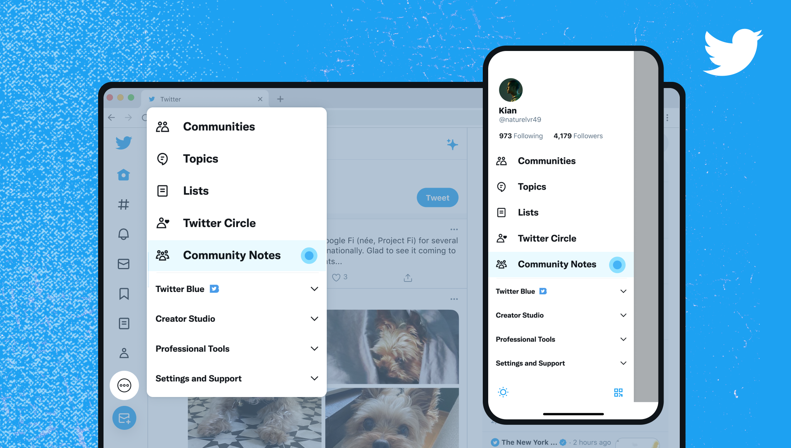
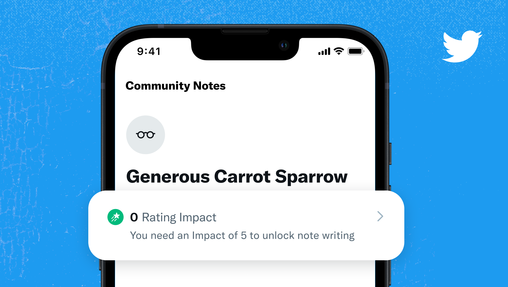

#  Getting started

## 1. Sign up

Anyone who meets the [eligibility criteria](../contributing/signing-up.md) can sign up to become a Community Notes contributor. As there are important nuances in each market, we’ll expand the contributor base country-by-country.



## 2. Select an alias so you can keep your identity private

As a Community Notes contributor, you can now rate the helpfulness of all notes. But first, choose an alias to contribute under (it’s like a pen name!)



## 3. Begin rating notes

Your ratings help determine which notes are made visible on X. To start rating notes, navigate to Community Notes from your X app navigation bar. There, you'll find the notes where your ratings can have the most impact.



## 4. Soon, you'll unlock the ability to write your own notes!

To unlock the ability to write notes, you need to earn a Rating Impact of 5. You earn Impact when your rating helps a note earn a helpful (or unhelpful) status! You can track your progress on the Rating Impact section of your Community Notes profile.



### Confused? Need a hand? Have feedback?

Don’t hesitate to get in touch with the Community Notes team! You can reach us by posting to or DMing
[@CommunityNotes](https://x.com/communitynotes). We’re so glad you’re here!
