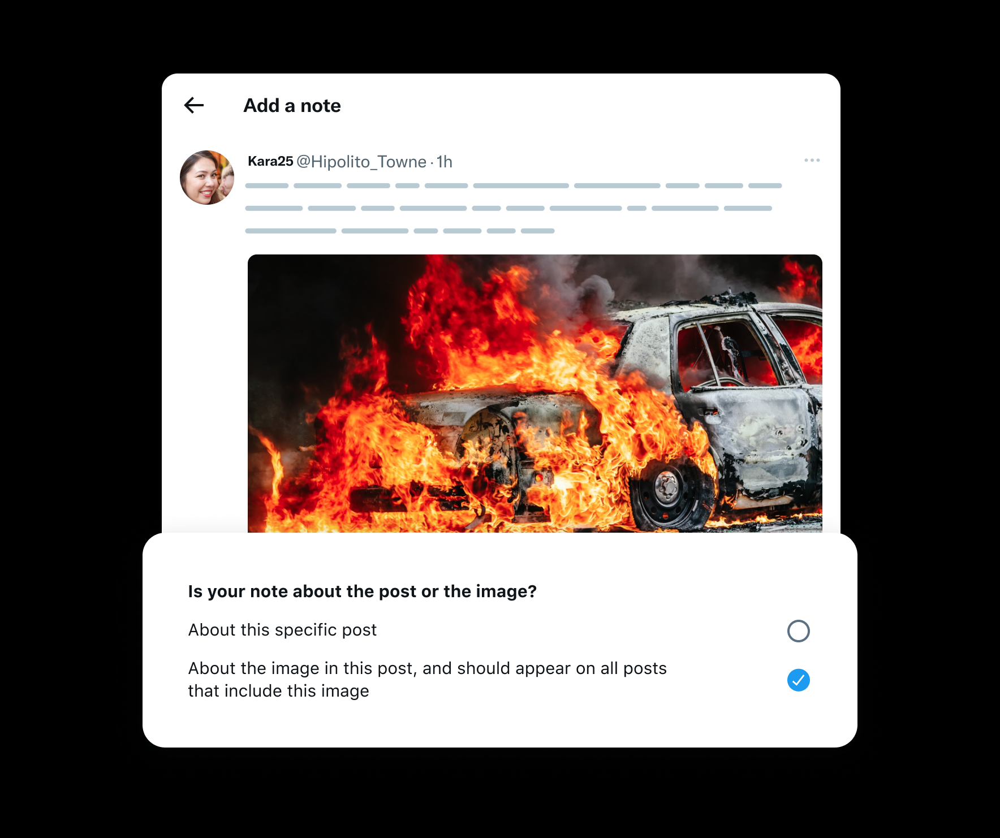
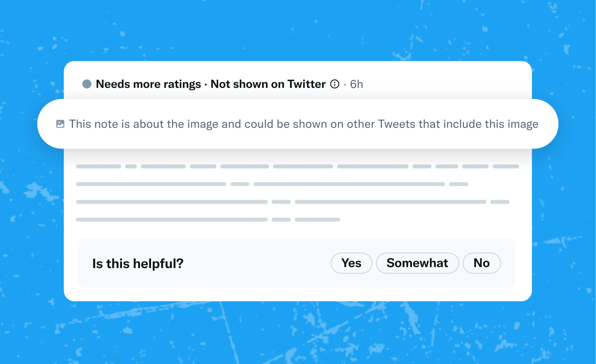

# Notes on Media

Community Notes are frequently added to posts that feature images or videos. In many cases, these notes can provide valuable context, not just for a single post, but for any post containing the same media.

Contributors with a Writing Impact score of 10 or above have the option to write notes about the media found within posts, as opposed to focusing on the specific post. Contributors should select this option when they believe the context added would be helpful independently of the post the note is attached to.

Tagging notes as “about the image” makes them visible on all posts that our system identifies as containing the same image. These notes, when deemed Helpful, accumulate view counts from all the posts they appear in, but only count as one Writing and Rating Impact for the author and raters.

To ensure transparency, raters will see a disclaimer indicating that notes about the image may appear across multiple posts. This way, they'll be aware that the context provided by these notes extends beyond the specific post they're currently viewing.

When someone rates a media note, the rating is associated with the post on which the note appeared. This allows Community Notes to identify cases where a note may not apply to a specific post.

Currently, this feature is experimental and only supports posts with a single image. We're actively working on expanding it to support posts with multiple images, GIFs, and videos. Stay tuned for updates.
