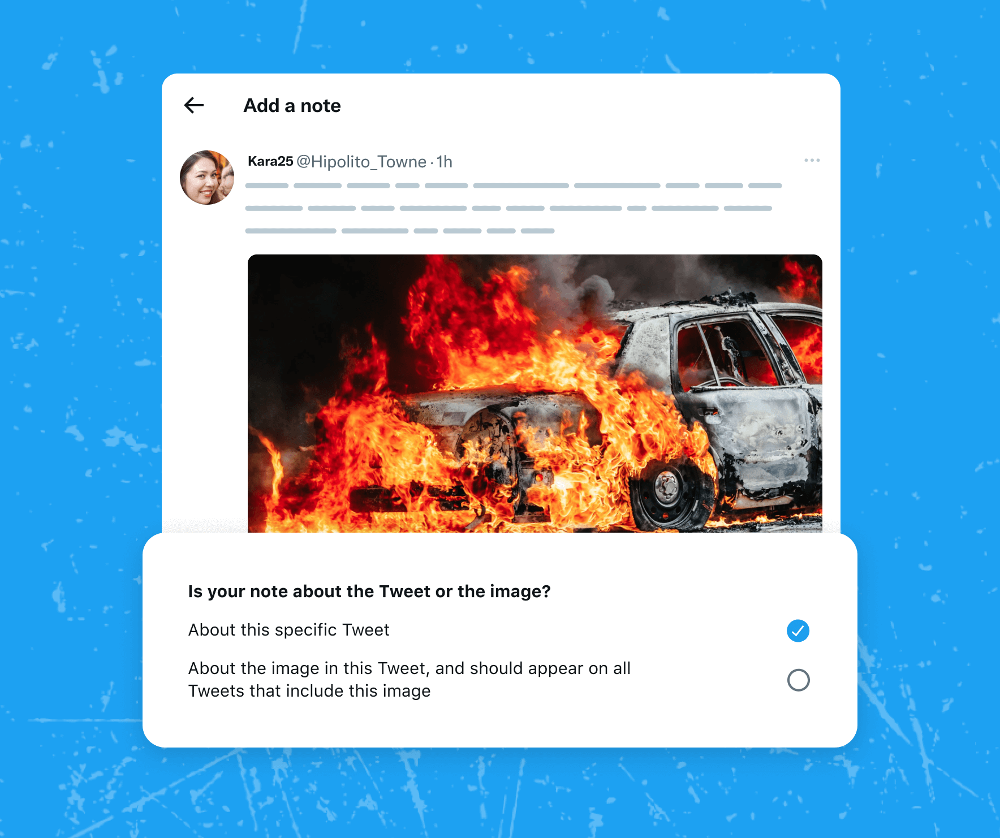

# Notes on Media & Links

Community Notes are frequently added to posts that feature images, videos or links. In many cases, these notes can provide valuable context, not just for a single post, but for any post containing the same media.

Contributors with a [Writing Impact score of 2 or above](../under-the-hood/media-matching.md) have the option to write notes about the media found within posts, as opposed to focusing on the specific post. Contributors with a Writing Impact score of 10 or above also have the option to write notes about links found within posts.

Contributors can select one of these options when they believe the context added would be helpful independent of the post the note is attached to.

Tagging notes as “about the image” (or video, or link) makes them visible on all posts that our system identifies as containing a matching image, video or link. These notes, when deemed Helpful, accumulate view counts from all the posts they appear in, but only count as one Writing and Rating Impact for the author and raters.

To ensure transparency, raters will see a disclaimer indicating that notes about the media may appear across multiple posts. This way, they'll be aware that the context provided by these notes extends beyond the specific post they're currently viewing.

When someone rates a media note, the rating is associated with the post on which the note appeared. This allows Community Notes to identify cases where a note may not apply to a specific post.

Currently, this feature supports posts with a single image or single video, or a link. We may expand it to cover posts that contain multiple media.
