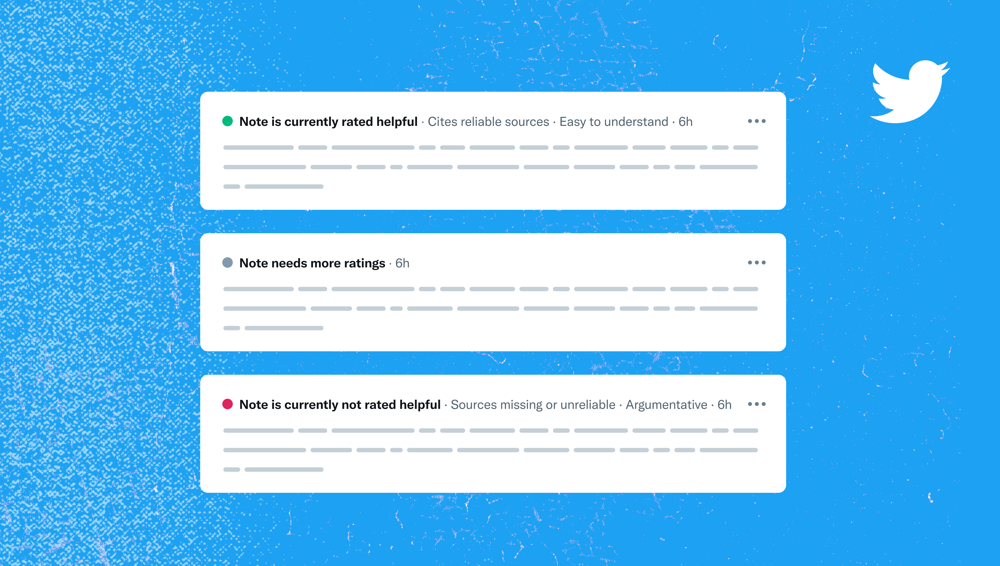

# Notes shown on X

Community Notes' goal is to show helpful context to people when they come across potentially misleading information on X. When a note is rated Helpful by contributors, it starts being shown directly on the post. Here's how they show up:

## How do notes start showing on X?

All proposed notes start with the status of **Needs More Ratings**, and are shown to Contributors in order to gather ratings.

If you are a Community Notes contributor, you'll see a prompt on posts that have proposed notes. Tap the prompt to rate those notes.

If enough contributors from [different points of view](./diversity-of-perspectives.md) rate a note as **helpful**, it earns a status of "Helpful", and starts showing on X.

If enough contributors rate a note as **not helpful**, it reaches a status of "Not Helpful", and is not shown on X. Contributors whose notes consistently reach this status may have their [writing ability temporarily locked](./writing-ability.md).

Note statuses are updated as new ratings come in, so notes may show on X and then disappear. Statuses are locked after 2 weeks.
