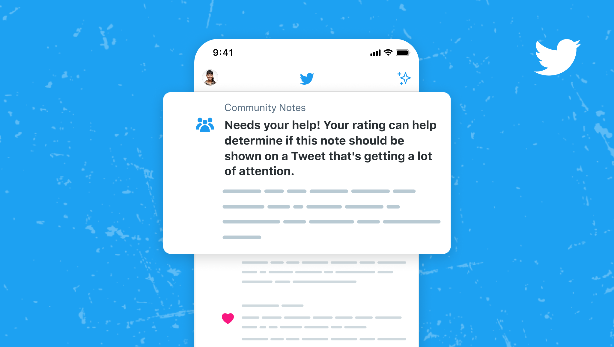
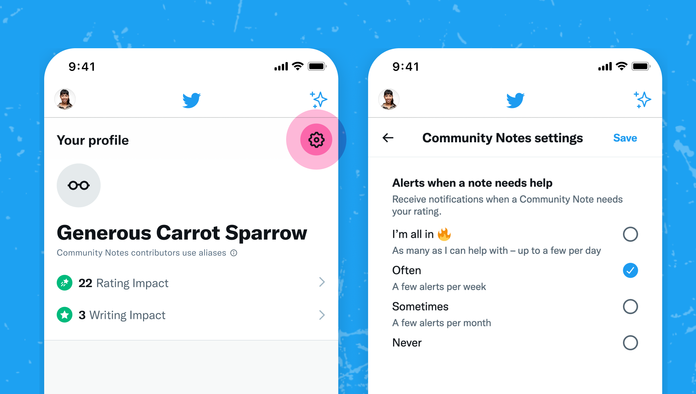

# Notifications

## Readers added a note to a Tweet to which you replied, Liked or Retweeted

Sometimes, people read a Tweet before a Community Note appears on it. To give people more context in those cases, Community Notes sends notifications to everyone who has replied to, Liked or Retweeted a Tweet after a note starts showing on it.

These appear in the notifications tab. They look like this:

These notifications are sent when a note has been showing on a Tweet for 24 hours, has been found particularly helpful (indicated by a [note intercept score](../under-the-hood/note-ranking-code.md) of 0.45 or higher), and was written within the past week.

## Alerts when a note needs your help

Notes have the most impact when they get rated quickly and start showing on Tweets early. To ensure contributors don't miss the opportunity to rate notes on Tweets getting a lot of attention, Community Notes sends alerts requesting help from time to time.

If you are a contributor, you'll see these alerts in your notifications tab. They look like this:

To learn more about how Community Notes decides which notes trigger these alerts, see [Under the Hood – Needs Your Help](../under-the-hood/timeline-tabs.md)

### Notification settings

The default setting for all contributors is "Often", which means you'll start by getting a few alerts per week. You can change that frequency by visiting your Community Notes profile and tapping the gear icon on the top right, or by clicking the button below:



## Other notifications

Contributors also receive notifications with status updates about the notes they've written and rated. At this time these are not configurable, but we plan to add more controls in the future.
