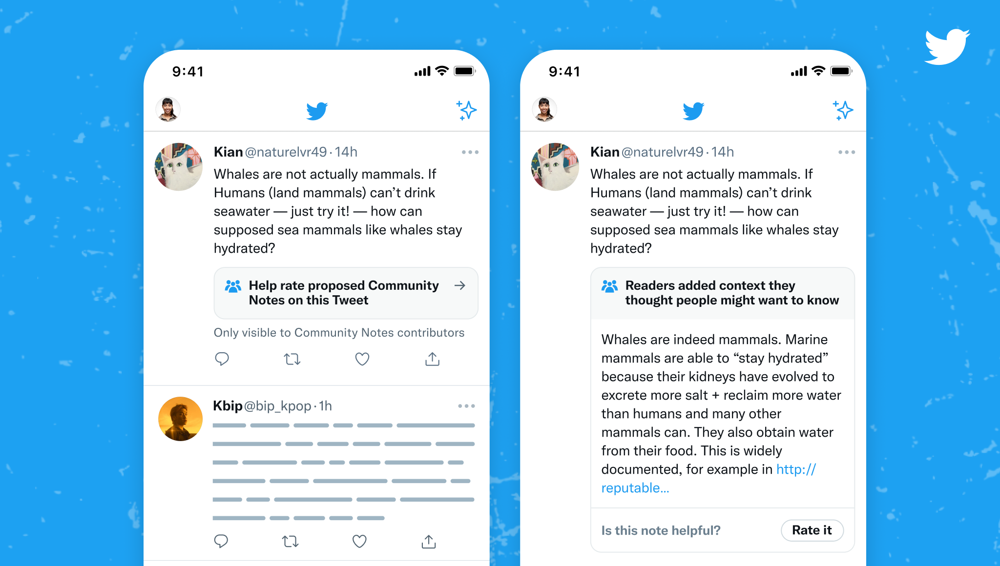

# Rating notes

Ratings help identify which notes are helpful enough to show on Twitter and notes that are not helpful and should not be shown.

## Rating notes on the Community Notes site

Go to the [**Community Notes Home page**](https://communitynotes.twitter.com) and choose any Tweet to see notes that contributors have added to it. There are three main timelines on this page:

- **Needs your help:** Contains Tweets with notes where you can have the most impact when rating. This tab is only visible to Community Notes contributors.

- **New:** Contains Tweets with the most recent notes.

- **Rated Helpful:** Contains Tweets with at least one note rated helpful by the community.

## Rating notes on Twitter

Community Notes contributors and people on Twitter may also see notes and prompts in their timeline when browsing Twitter.

## Rating Impact

When your ratings help a note reach a status of Helpful or Not Helpful, you'll earn Rating Impact. [Learn more here](./writing-and-rating-impact)
