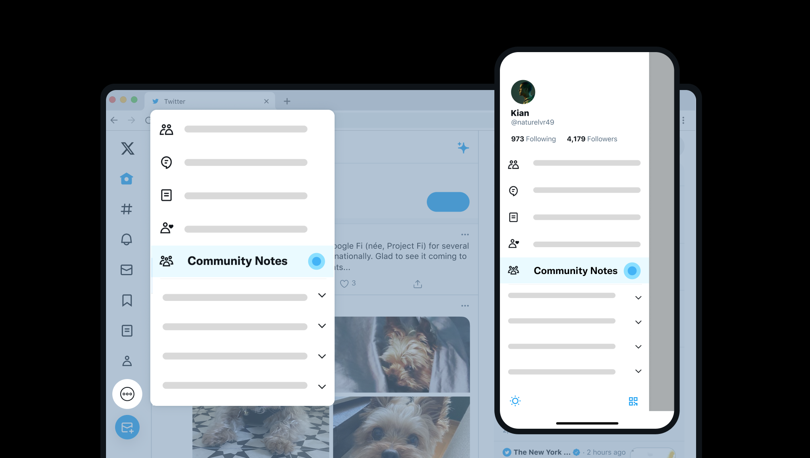
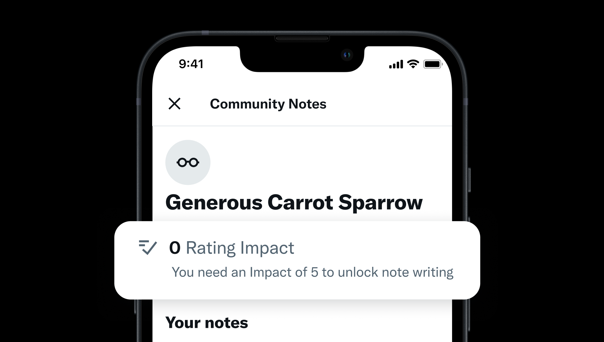

# Welcome to Community Notes!

You're now a Community Notes contributor 🎉

## 1. Select an alias so you can keep your identity private

As a Community Notes contributor, you can now rate the helpfulness of all notes. But first, choose an alias to contribute under (it’s like a pen name!)



## 2. Begin rating notes

Your ratings help determine which notes are made visible on X. To start rating notes, navigate to Community Notes from your app's navigation bar. There, you'll find the notes where your ratings can have the most impact.



## 3. Soon, you'll unlock the ability to write your own notes!

To unlock the ability to write notes, you need to earn a Rating Impact of 5. You earn Impact when your rating helps a note earn a helpful (or unhelpful) status! You can track your progress on the Rating Impact section of your Community Notes profile.



### Confused? Need a hand? Have feedback?

Don’t hesitate to get in touch with the Community Notes team! You can reach us by posting to or DMing
[@CommunityNotes](https://x.com/communitynotes). We’re glad you’re here!
