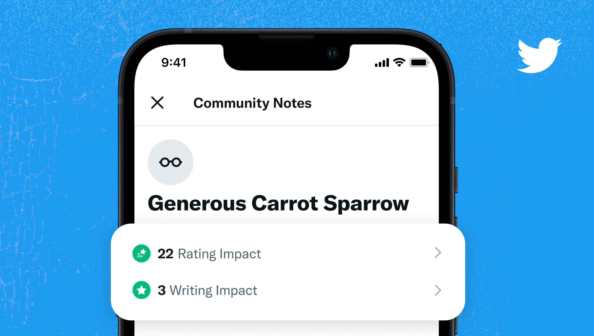
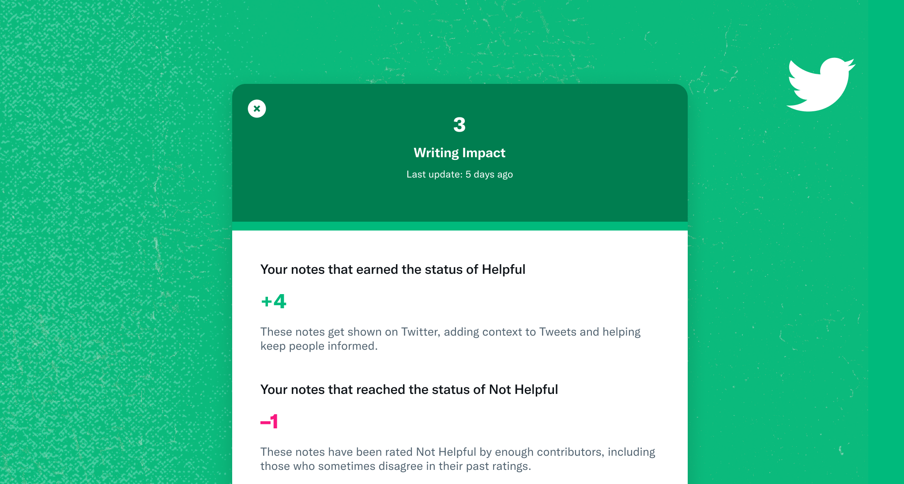

# Rating and Writing Impact

The two most important activities in Community Notes are [writing notes](./writing-notes.md) and [rating notes](./rating-notes.md). Contributors can see the history of their past Writing Impact and Rating Impact on their profiles.

## Writing Impact

Writing Impact reflects how often a contributor's notes have earned a status of Helpful when rated by others. Impact increases when a note earns the status of Helpful, and decreases when a note reaches the status of Not Helpful.

Notes in ‘Needs More Ratings’ status don't count towards Writing Impact.

### How can I increase my Writing Impact?

To increase your Impact, you need to write notes that earn the status of Helpful when rated by other contributors.

Note statuses [aren’t reached by majority rule](./diversity-of-perspectives.md). A note will reach a status of Helpful or Not Helpful only when there's agreement between contributors who have sometimes disagreed in their past ratings. This helps prevent one-sided ratings.

Here are some tips on how to [write helpful notes](./examples.md).

## Rating Impact

Rating Impact reflects how often a contributor's ratings helped the community identify notes that earned a status of Helpful or Not Helpful. It increases when a contributor rates a note before it has reached a status, and when their rating matches the status reached by the note. Impact decreases when a contributor rates a note opposite the status it later reaches.

Note statuses can change any time as more ratings come in, and can be overturned if a [broad enough group of contributors agrees](./diversity-of-perspectives.md) that it should change.

### How do I increase my Rating Impact?

To increase this impact, you should look for notes that need more ratings, and rate them. The best ways to do this are by browsing the [Needs Your Help](https://x.com/i/communitynotes/needs_your_help) tab in Community Notes, and by looking out for alerts when a note needs your rating.

1. **Help identify notes as Helpful**

   When you help a note earn the status of Helpful, it gets shown on X as context, helping keep people informed.

2. **Help identify notes as Not Helpful**

   When you help a note reach a status of Not Helpful, you're also improving Community Notes. Note authors get feedback based on your rating, and other raters can more easily focus on the most promising notes.

Here are [tips on how to identify Helpful and Not Helpful notes](./examples.md).

---

## Frequently asked questions

### How does Community Notes prevent bias and one-sided ratings?

Note statuses [aren’t reached by majority rule](./diversity-of-perspectives.md). A note will reach a status of Helpful or Not Helpful only when there's some agreement between contributors who have sometimes disagreed in their past ratings. This helps prevent one-sided ratings.

### Why does Rating Impact decrease when a contributor's rating is the opposite of the note's status?

Contrasting ratings are important. They help make sure the best notes get seen, and can often help overturn the status of a note. However, contrasting ratings that don't contribute to changing a note's status need to be discounted to prevent simple manipulation strategies. (For example: a contributor acting in bad faith could increase their score by rating many notes randomly and earning Rating Impact for the ones where their rating happened to agree with the status reached.)

This approach helps make sure Rating Impact reflects the net impact that people find helpful. We expect everyone to have some contrasting ratings, and this disagreement is important, so don’t worry if you have some!

### Do scores change when a note is deleted?

When a note is deleted, its content is removed. However, contributors continue to earn Writing Impact and Rating Impact based on the status of the note. This is important, as it prevents people from gaming impact scores by deleting notes that have reached a status of Not Helpful.

### Can scores go negative?

Yes. Both scores can go negative.

### Are scores public?

Yes, scores are shown publicly on contributor profiles.
