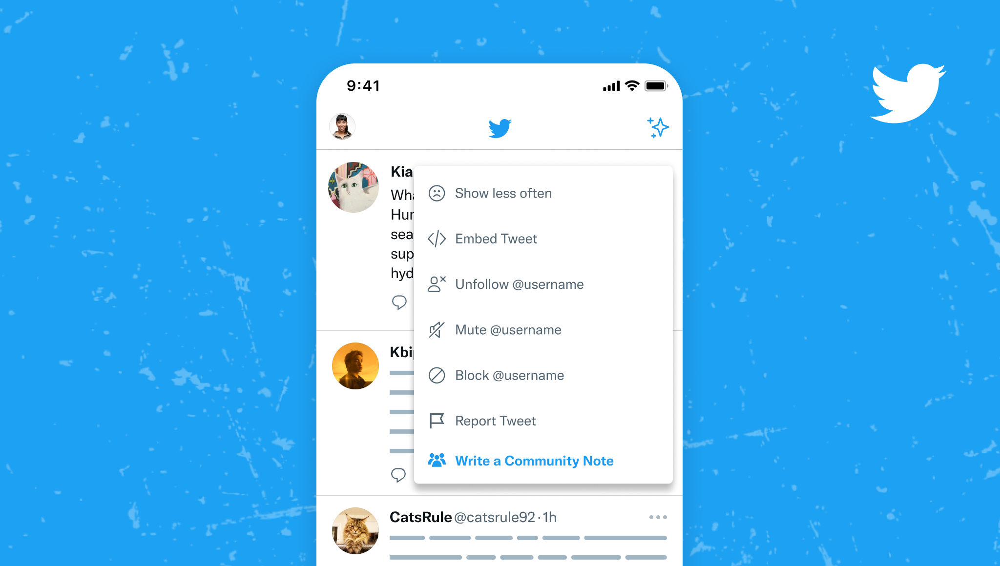

# Writing notes

Anyone can read and rate Community Notes, but only contributors who've [unlocked the ability to write](./writing-ability.md) can add new notes to posts. Here's how to add a note:

1. Click or tap the ••• menu on the post's top right and then **Write a Community Note**.

2. Answer the required multiple choice questions and write the context you feel would help others understand why that post is or is not misleading.

   If your note claims post is potentially misleading and would benefit from added context, it will be eligible to show on the post if it is rated as helpful by enough people.

   If you claim the post is not misleading, you note will be shown to other raters as additional information, but won't show on the post if it earns a status of Helpful.

3. After it’s submitted, the note will be available on the Community Notes site for other contributors to read and rate.

4. If your note earns the status of Helpful, it will be [shown on X as context](./notes-on-twitter) and you'll earn [Writing Impact](./writing-and-rating-impact.md).

5. You can delete your notes at any time by clicking or tapping the ••• icon on a note.

### Note writing limit

To keep note quality high and prevent spam, there’s a limit to the number of note proposals contributors can write in a given time period (e.g. 24 hours).

#### Overall limit
The overall limit for a 24 hour period is based on both the contributor's:
* [Writing Impact](./writing-and-rating-impact.md) score
* Helpful note hit rate (defined as Writing Impact divided by total number of notes written)

If Writing Impact is negative, the limit is 1. Otherwise, the limit is the minimum of:
* Writing Impact + 5
* Hit rate × 200

This dynamic limit helps ensure that contributors can write more notes as they build a track record of writing notes people find helpful.

For example, if one has a hit rate of 20% (common among top writers):

- A contributor with -1 Writing Impact can write 1 note every 24 hours.
- A contributor with 0 Writing Impact can write 5 notes every 24 hours.
- A contributor with 3 Writing Impact can write 8 notes every 24 hours.
- A contributor with 12 Writing Impact can write 17 notes every 24 hours.
- …etc

However, to limit large numbers of proposed notes in lower hit rate cases, if one has a hit rate of 5%:

- A contributor with 12 Writing Impact but 5% hit rate can write 10 notes every 24 hours.
- A contributor with 100 Writing Impact but 5% hit rate can write 10 notes every 24 hours.

#### Post author limit

Contributors’ ability to write proposed notes on a single post author is determined by how helpful the community has found their past contributions. 
- Initially, a contributor can write up to 3 notes in a 24 hour period on a given post author 
- After 6 total notes on a given post author:
   - If author-specific CRH rate (CRH notes/total proposed notes on post author) is at least 5%, the per post author limit is equal to the hit rate in percent, rounded down.
   - If author-specific CRH rate is between 1% and 5% (or less than 1% but with fewer than 15 total proposed notes), the per post author limit is equal to 1 note per day.
   - If author-specific CRH rate is less than 1% and at least 15 total notes have been proposed, the per post author limit is 1 note per week.

These CRH hit rates are calculated with notes written since May 28, 2025. The limits are also subject to overall note limits described above.

### What makes a good Community Note?


