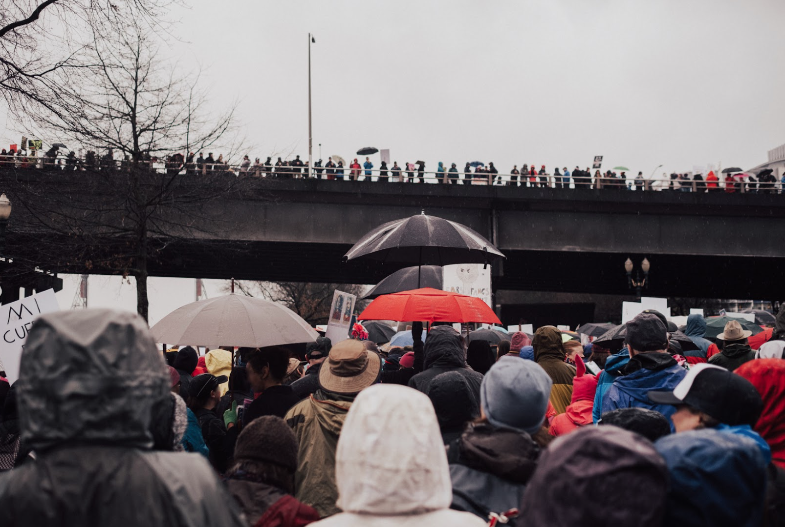

Great notes provide helpful context to Tweets and leave people better informed. But what makes a note helpful?

## Helpful attributes

- Cites high-quality sources
- Easy to understand
- Directly addresses the Tweet’s claim
- Provides important context
- Neutral or unbiased language

 

## Unhelpful attributes

Helpful notes steer clear of all of these unhelpful attributes:

- Sources not included or unreliable
- Sources do not support note
- Incorrect information
- Opinion or speculation
- Typos or unclear language
- Misses key points or irrelevant
- Argumentative or biased language
- Note not needed on this Tweet
- Harassment or abuse

 
 

The following are examples of notes that illustrate what makes a note helpful (versus unhelpful):

## Example 1

    <h3> Tweet </h3>
    

        

            
            

                
Kian

                
@naurelvr49

            

        

        

            
Another big day at the Supreme Court ending with a police car being lit on fire. 😨

            
        

    

<h3> Helpful note </h3>

This photo was taken in Toronto at a protest of the 2010 G20 summit where G20 officials met to discuss the world economy, not at the Supreme Court in Washington D.C. You can see the car in this photo being lit on fire via a local Toronto news broadcast: https://www.youtube.com/watch...

- Cites high-quality sources
- Easy to understand
- Directly addresses the Tweet’s claim
- Provides important context
- Neutral or unbiased language

<h3> Helpful note </h3>

The last time it was reported that a police car was lit on fire outside the Supreme Court was on 7/15/2020. This photo is not from that incident. This photo was taken in Toronto at a protest of the 2010 G20 summit. https://www.cbsnews.com/news/..., https://www.cp24.com/breaking/...

- Cites high-quality sources
- Easy to understand
- Directly addresses the Tweet’s claim
- Provides important context
- Neutral or unbiased language

<h3> Unhelpful note </h3>

Wow, people really hate cops. They just park there car to go into the office and it’s suddenly fair game to be torched. Some of you need to relax.

- Sources not included or unreliable
- Opinion or speculation
- Typos or unclear language
- Misses key points or irrelevant
- Argumentative or biased language

<h3> Unhelpful note </h3>

This is totally made up. There are no reports of a fire outside the Supreme Court today. Twitter should ban this account for spreading lies. https://www.supremecourt.gov/

- Sources do not support note
- Incorrect information
- Opinion or speculation
- Misses key points or irrelevant

## Example 2

    <h3> Tweet </h3>
    

        

            
            

                
Kian

                
@naurelvr49

            

        

        

            
Protesters in Medyka, Poland, a small town that borders Ukraine, respond to the number of Ukrainian refugees who have relocated to Poland since Russia invaded. They say that the extension of Ukrainian work visas is starting to limit job opportunities for native Poles.

            
        

    

<h3> Helpful note </h3>

Medkya is the largest crossing point for Ukrainian refugees into Poland but there have been no protests reported. In fact, the Poles have welcomed refugees and called for more resources to support the Ukrainian people. https://www.unhcr.org/en-us/news/stories...

- Cites high-quality sources
- Easy to understand
- Directly addresses the Tweet’s claim
- Provides important context
- Neutral or unbiased language

<h3> Helpful note </h3>

A reverse image search places this photo at the 2/21/17 Women’s March in Portland, Oregon. And there are no recorded protests in response to Ukrainian refugees crossing into Medyka, Poland. https://www.npr.org/2022/05/19/...

- Cites high-quality sources
- Easy to understand
- Directly addresses the Tweet’s claim
- Provides important context
- Neutral or unbiased language

<h3> Unhelpful note </h3>

One of the protes signs is in English?! Unlikely this protest is in small Polish town where few people can speak English. https://en.wikipedia.org/wiki/...

- Sources do not support note
- Opinion or speculation
- Typos or unclear language
- Misses key points or irrelevant
- Argumentative or biased language

<h3> Unhelpful note </h3>

There’s no protests. No one wants to keep people seeking asylum out. This isn’t America!

- Sources not included or unreliable
- Opinion or speculation
- Misses key points or irrelevant
- Argumentative or biased language

