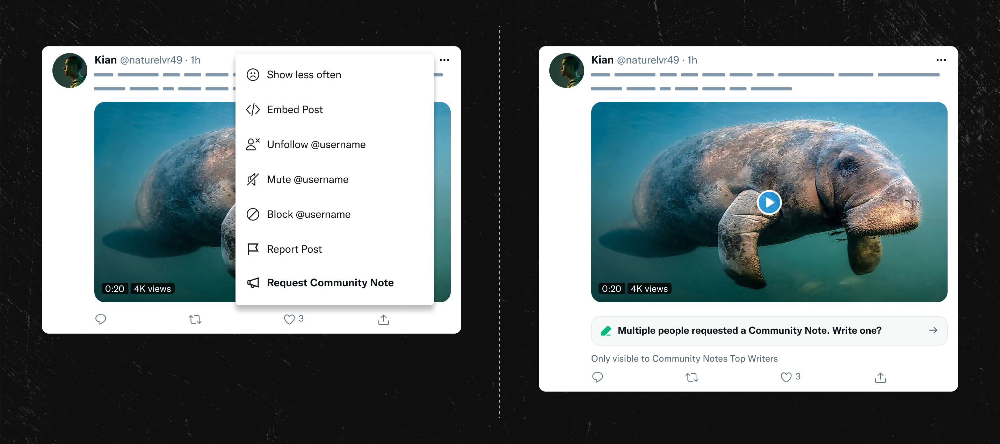

# Request a Community Note

People on X can request a Community Note on a post they believe would benefit from one. If there are enough requests, Community Notes contributors will see an alert, and can choose to propose a note. This gives people on X who are not contributors a way to help, and lets contributors know where notes might be found helpful.

### Requesting a note

- Tap the ••• menu on a post, then tap **Request Community Note**
- To be eligible to request a note, accounts must have a **verified phone number**
- Initially, accounts can make up to 5 requests per day. The limit may increase if requests successfully result in helpful notes, or may decrease if requests are on posts that people don’t agree need a note. This helps prevent spam and keep note writers focused on posts that could use helpful notes.

### Contributors seeing requests

Contributors who have earned [Top Writer status](../contributing/top-contributors.md) will see that there are requests on a post, if there are enough requests.

These contributors can also go to their [Community Notes tab](https://x.com/i/communitynotes) to see a feed on posts with note requests.

Requests will show on a post if at least one of these criteria are met:
- the total number of requests on the post is greater than or equal to MAX(4, number of views on post / 25000)
- there are at least 2 requests on the post from users with 'medium' or better [requestor helpfulness scores](#requestor-helpfulness-scores)
- there is one request on the post from a user with a 'high' [requestor helpfulness score](#requestor-helpfulness-scores)

Requests will show for 24 hours. For a post to show up in the Note Requests timeline, the post must be recent (less than 24 hours old)

We expect these criteria to evolve, with the goal that requests are frequently found valuable to contributors, and not noisy.

### Requestor helpfulness scores

We compute note requestor helpfulness scores for each user who requests notes. No matter the requestors' helpfulness score, all requests count, but requestors with higher helpfulness scores will need fewer other users to also request a note before other contributors see their request.

First, we compute the following values for each requestor:
- totalEligibleRequestsMadeByUser: Total number of requests made on posts before there was already a proposed note
- crhNoteOnEligibleRequestedPost: Total number of posts that ended up with 'Currently Rated Helpful' notes after the user made an eligible note request on the post
- hitRate: crhNoteOnEligibleRequestedPost/totalEligibleRequestsMadeByUser

Then requestors can earn 'Medium' or 'High' requestor helpfulness scores as follows:
- A requestor gets a 'High' helpfulness score if they have a hitRate >= 0.08 and crhNoteOnEligibleRequestedPost >= 5
- A requestor gets a 'Medium' helpfulness score if they have a hitRate >= 0.03 and crhNoteOnEligibleRequestedPost >= 1

### Adding sources to a request

People can add a source when requesting a Community Note. Initially one can add other X posts as a source. We know people sometimes see a reply or quote with useful added context, and then request a note. The ability to include a source makes it easy to send that info to prospective note writers.

When Community Notes contributors see requests for a note, they'll also see any source posts requestors have provided. Initially, to help keep quality high, the system will attempt to avoid showing source posts that might be potential spam, or for example, that have been muted by the contributor viewing. The source feature is new, and we expect it to evolve.
