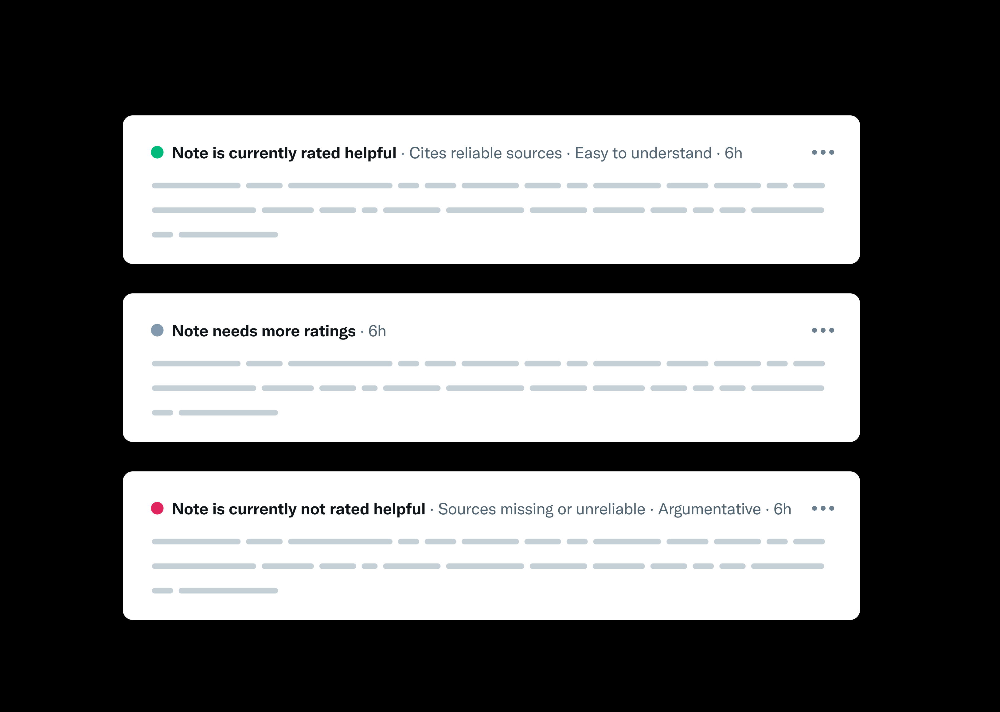

# Note ranking algorithm

The algorithm used to rank Community Notes and compute their statuses is open-source, so anyone can help us identify bugs, biases, and opportunities for improvement. This page describes in detail how that algorithm works and how we've improved it over time. The algorithm source code can be [found here](https://github.com/twitter/communitynotes/tree/main/sourcecode).



## Note Status

Community Notes are submitted and rated by contributors. Ratings are used to determine note statuses (“Helpful”, “Not Helpful”, or “Needs More Ratings”). Note statuses determine which notes are displayed on each of the [Community Notes Site’s timelines](./timeline-tabs.md), and which notes are displayed [on posts](../contributing/notes-on-twitter.md).

All Community Notes start with the Needs More Ratings status until they receive at least 5 total ratings.
Notes with 5 or more ratings may be assigned a status of Helpful or Not Helpful according to the algorithm described below.
If a note is deleted, the algorithm will still score it (using all non-deleted ratings of that note) and the note will receive a status if it’s been rated more than 5 times, although since it is deleted it will not be shown on X even if its status is Helpful.

Notes marking posts as "potentially misleading" with a Note Helpfulness Score of 0.40 and above earn the status of Helpful. At this time, only notes that indicate a post is “potentially misleading” and earn the status of Helpful are eligible to be displayed on posts.
Notes with a Note Helpfulness Score less than -0.05 -0.8 \* abs(noteFactorScore) are assigned Not Helpful, where noteFactorScore is described in [Matrix Factorization](#matrix-factorization). Additionally, notes with an upper confidence bound estimate of their Note Helpfulness Score (as computed via pseudo-raters) less than -0.04 are assigned Not Helpful, as described in [Modeling Uncertainty](#modeling-uncertainty).
Notes with scores in between remain with a status of Needs more Ratings.

Identifying notes as Not Helpful improves contributor helpfulness scoring and reduces the time contributors spend reviewing low quality notes.
We plan to enable Helpful statuses for notes marking posts as "not misleading" as we continue to evaluate ranking quality and utility to users.

When a note reaches a status of Helpful / Not Helpful, they're shown alongside the two most commonly chosen explanation tags which describe the reason the note was rated helpful or unhelpful.
Notes with the status Needs More Ratings remain sorted by recency (newest first), and notes with a Helpful or Not Helpful status are sorted by their Helpfulness Score.

This ranking mechanism is subject to continuous development and improvement with the aim that Community Notes consistently identifies notes that are found helpful to people from a wide variety of perspectives.

Rating statuses are computed at periodic intervals, so there is a time delay from when a note meets the Helpful / Not Helpful criteria and when that designation appears on the Community Notes site.
This delay allows Community Notes to collect a set of independent ratings from people who haven’t yet been influenced by seeing status annotations on certain notes.

## Helpful Rating Mapping

When rating notes, contributors answer the question “Is this note helpful?” Answers to that question are then used to rank notes. When Community Notes (formerly called Birdwatch) launched in January 2021, people could answer “yes” or “no” to that question. An update on June 30, 2021 allows people to choose between “yes,” “somewhat” and “no.” We map these responses to continuous values from 0.0 to 1.0, hereafter referred to as “helpful scores”:

- `Yes` maps to `1.0`
- `Somewhat` maps to `0.5`.
- `No` maps to `0.0`.
- `Yes` from the original 2-option version of the rating form maps to `1.0`.
- `No` from the original 2-option version of the rating form maps to `0.0`.

Specific values in the mapping may change in the future, and will be updated here.

## Matrix Factorization

The main technique we use to determine which notes are helpful or unhelpful is matrix factorization on the note-rater matrix, a sparse matrix that encodes, for each note and rater, whether that rater found the note to be helpful or unhelpful. This approach, originally made famous by Funk in the 2006 Netflix prize recommender system competition, seeks a latent representation (embedding) of users and items which can explain the affinity of certain users for certain items [[1](https://sifter.org/~simon/journal/20061211.html)] [[2](https://datajobs.com/data-science-repo/Recommender-Systems-[Netflix].pdf)]. In our application, this representation space identifies whether notes may appeal to raters with specific viewpoints, and as a result we are able to identify notes with broad appeal across viewpoints.

One challenge is that not all raters evaluate all notes - in fact most raters do not rate most notes - and this sparsity leads to outliers and noise in the data. Regularization techniques are a common solution to these issues; a key distinction in our approach is that we use much higher regularization on the intercept terms, which capture the helpfulness of a note or rater that is not explained by viewpoint agreement, relative to the embedding factors. This encourages a representation that uses user and note embeddings to explain as much variation in the ratings as possible before fitting additional note- and user-specific intercepts. As a result, for a note to achieve a high intercept term (which is the note’s helpfulness score), it must be rated helpful by raters with a diversity of viewpoints (factor embeddings). Notes are given a single global score-- their intercept term-- rather than using this algorithm in the traditional way to personalize content as in a recommender system.

We predict each rating as:

$$ \hat{r}_{un} = \mu + i_u + i_n + f_u \cdot f_n $$

Where the prediction is the sum of three intercept terms: $\mu$ is the global intercept term, $i_u$ is the user’s intercept term, and $i_n$ is the note’s intercept term, added to the dot product of the user and notes’ factor vectors $f_u$ and $f_n$ (note that when user and note factors are close, a user is expected to give a higher rating to the note).

To fit the model parameters, we minimize the following regularized least squared error loss function via gradient descent over the dataset of all observed ratings $r_{un}$:

$$ \sum_{r_{un}} (r_{un} - \hat{r}_{un})^2 + \lambda_i (i_u^2 + i_n^2 + \mu^2) + \lambda_f (||f_u||^2 + ||f_n||^2) $$

Where $\lambda_i=0.15$, the regularization on the intercept terms, is currently 5 times higher than $\lambda_f=0.03$, the regularization on the factors.

The resulting scores that we use for each note are the note intercept terms $i_n$. These scores on our current data give an approximately Normal distribution, where notes with the highest and lowest intercepts tend to have factors closer to zero.

In general, we set the thresholds to achieve a “Helpful” status at 0.40, including less than 10% of the notes, and our threshold to achieve a “Not Helpful” status at $-0.05 - 0.8 \* abs(f_n)$.
We also require that "Helpful" notes have $abs(f_n) < 0.50$ to identify notes that may lack broad support despite having an intercept $i_n > 0.40$.
We assign "Not Helpful" status to additional notes based on the upper bound of the uncertainty interval of their intercept (at $-0.04$) as defined in the [Modeling Uncertainty](#modeling-uncertainty) section.
The [Tag Outlier Filtering](#tag-outlier-filtering) section describes an extension to the general thresholds.

This approach has a few nice properties:

- Extra regularization on the intercept terms in practice requires that notes are rated by raters with diverse factors before a note gets a label (the note intercept term becomes very large or very small)
- We can represent multidimensional viewpoint spaces by increasing the dimensionality of the factors, without changing the algorithm itself
- Rater-specific intercept terms capture how lenient or generous each rater is with their helpful ratings
- We are able to include somewhat helpful ratings naturally as 0.5s

Note: for now, to avoid overfitting on our very small dataset, we only use 1-dimensional factors. We expect to increase this dimensionality as our dataset size grows significantly.

Additionally, because the matrix factorization is re-trained from scratch every hour, we have added additional logic to detect if the loss is more than expected (currently by detecting if the loss is above a hard threshold of 0.09) that may have resulted from an unlucky initialization and local mode, and then re-fit the model if so.

## Agreement Safeguards

The core Matrix Factorization approach for detecting contributor agreement has been extended with several safeguards as outlined below.

**Post Selection Similarity**

The Community Notes ranking algorithm includes mechanisms to detect similarities in the notes and posts that contributors engage with.
If the algorithm detects an anomalous correlation, the associated contributors are treated as a single contributor to address any potential impacts on note ranking outcomes.
Like the rest of ranking, this system follows Community Notes principles and works entirely on open and public data with open and public effects.

**Net Helpful Minimums**

Matrix factorization identifies notes that are liked by people who normally disagree by assigning high intercepts to notes when users with different factors rate the note Helpful.
In cases where there are few ratings available from a given part of the factor space, matrix factorization is forced to estimate the note intercept based on the limited data available.
Unfortunately, acting based on limited rating signal can result in volatility in the note intercept as new ratings arrive, leading to note status changes.

To reduce the likelihood that notes are shown to users as Helpful and then change status, we impose requirements on the available ratings before notes can be issued Helpful status.
We define the _Net Helpful Ratings_ as the number of Helpful ratings minus the number of Not Helpful ratings, and compute the Net Helpful Ratings separately for users with positive and negative factors.
We define the _Net Helpful Ratio_ as the Net Helpful Ratings divided by the total number of ratings combined over users with positive and negative factors.
For a model to rate a note as Helpful, we require that either:
* The note has a Net Helpful Ratings of 10 or greater from both positive and negative factor raters, or
* The note has a Net Helpful Ratings of 4 or greater and a Net Helpful Ratio of 0.05 or greater from both positive and negative factor raters.

Notes that otherwise meet the Helpful standard but fail either the Net Helpful Ratings or Net Helpful Ratio requirements are highlighted to contributors with a special note preview UI treatment to encourage more ratings.
Once the note meets Net Helpful minimums and all other Helpful status criteria, the model will rate the note as Helpful.

**Baseline Intercept: Rater Engagement**

The Community Notes ranking algorithm leverages contributor ratings to identify notes that are found helpful by people from different perspectives.  Since contributor usage patterns can vary, the ranking algorithm includes a _baseline intercept_ to validate that contributors at all activity levels find notes helpful, including both the most occasional and most active contributors.

The baseline intercept is computed by omitting ratings from contributors in the top 0.1% of rating volume among active raters over the last 7d or 28d.  Similar to Net Helpful Minimums, if a note otherwise meets Helpful criteria but the baseline intercept is below 0.37, the note will be highlighted to contributors with a special note preview UI treatment to encourage more ratings. Once the baseline intercept and all other Helpful status criteria are met, the model will rate the note as Helpful.

**Baseline Intercept: Rater Independence**

The Rater Independence intercept has some conceptual similarity to both the Rater Engagement intercept and Post Selection Similarity (PSS).
Like Rater Engagement, Rater Independence re-runs the matrix factorization to compute a safeguard intercept that helps identify notes found helpful by people from different perspectives.
Like PSS, the safeguard mechanism involves identifying groups of raters with similar engagement patterns.

Whereas PSS identifies pairs of raters with anomalous correlation, the Rater Independence mechanism takes a broader approach to identify dense subgraphs within the bi-partite graph associating raters and posts.
Each dense subgraph is defined by a list of raters and posts, and each node (whether a rater or post) must meet a minimum edge density requirement.

Similar to Net Helpful Minimums and the Rater Engagement Intercept, if a note otherwise meets Helpful criteria but the Rater Independence intercept is below 0.37, the note will be highlighted to contributors with a special note preview UI treatment to encourage more ratings.
Once the baseline intercept and all other Helpful status criteria are met, the model will rate the note as Helpful.

**Pseudo-rating Sensitivity Analysis**

While the matrix factorization approach has many nice properties, it doesn't give us a natural built-in way to estimate the uncertainty of its parameters. One approach that we use to help quantify the uncertainty in our parameter estimates is by adding in "extreme" ratings from "pseudo-raters", and measuring the maximum and minimum possible values that each note's intercept and factor parameters take on after all possible pseudo-ratings are adding. We add both helpful and not-helpful ratings, from pseudo-raters with the max and min possible rater intercepts, and with the max and min possible factors (as well as 0, since 0-factor raters can often have outsized impact on note intercepts). This approach is similar in spirit to the idea of pseudocounts in Bayesian modeling, or to Shapley values.

We currently assign notes a "Not Helpful" status if the max (upper confidence bound) of their intercept is less than -0.04, in addition to the rules on the raw intercept values defined in the previous section.

**Supervised Confidence Modeling**

We also employ a supervised model to detect low confidence matrix factorization results.
If the model predicts that a note will lose Helpful status, then the note will remain in Needs More Ratings status for up to an additional 180 minutes or until the supervised model predicts the note will remain rated Helpful.
The additional time in Needs More Ratings status allows the note to gather a larger set of ratings.
If after that time the note still meets Helpful standards based on the matrix factorization scoring, the note will be rated Helpful and shown on X.
In all cases, the final status of the note is determined by matrix factorization.
The maximum effect of the supervised model is no more than a 180 minute delay, and all notes will receive a minimum 30 minute delay to gather additional ratings. 
This helps reduce notes briefly showing and then returning to Needs More Rating status.

The training data for the supervised confidence model includes all notes that meet the criteria for Helpful status _at some point in time_.
Notes that _ultimately lose_ Helpful status are treated and positives, and notes that _retain_ Helpful status are treated as negatives.
The features employed by the model include:
- Helpfulness and tag ratings from individual contributors
- Aggregate ratios of helpful and non-helpful tags across all ratings for a note
- Statistics summarizing the Helpful ratings for a note (e.g. standard deviation of user factors from Helpful ratings)
- Bucket counts of Helpful, Somewhat Helpful and Not Helpful ratings, partitioned by user factor $f_u$ as positive ($f_u >.3$), neutral ($-.3 \leq f_u \leq .3$) and negative ($f_u <-.3$)
- Burstiness of ratings associated with the note

Since ratings are often a reflection of both a note _and the associated post_, we also include ratings from _other notes on the same post_.
We refer to other notes on the same post as _peer notes_.
For example, if a note already has many peer notes that have been frequently assigned the Note Not Needed tag, the tag may reflect the associated post and all proposed notes may experience similar rating outcomes.
During feature extraction, we vectorize features for peer notes suggesting the post is misleading and not-misleading separately since the meaning of the rating changes depending on agreement between the note and the post.

The model uses logistic regression to predict note status outcomes.
The feature vectorization process involves both discretization and feature crosses, yielding a sparse representation and allowing the model to learn non-linear relationships.
The model is calibrated to delay Helpful status for no more than 60% of notes that ultimately stabilize to Helpful status.

**Population Sample Filtering**

In general, it's very useful for contributors to be able to rate whatever notes they are interested in rating, and the scoring algorithm described on this page is designed to be robust to notes that get more ratings from contributors with one viewpoint than another. But in the event that ratings from users who self-selected whether to rate a particular note disagree substantially with ratings from users who were randomly sampled from the population (in that they were responding to randomly-sent notifications requesting their help to rate a particular note), then the ratings from the random population sample can override the self-selected raters.

Each rating has an associated source which indicates whether a contributor rated a note after receiving a randomized notification where they were specifically asked to rate a particular note – these are considered population-sampled – or whether they discovered the note some other way (e.g. maybe they saw a proposed note on their For You page, or followed a link directly to the note, or found the note on one of the [timeline tabs](../under-the-hood/timeline-tabs.md) like "Needs your help" or "New").

Then, for any note scored by the core model with at least 8 population-sampled ratings, a separate matrix factorization is run on just the population-sampled ratings, where we learn the note's population-sampled intercept score $i_{n}^{pop}$. If a note was otherwise going to be Currently Rated Helpful based on self-selected (default) raters, it will be filtered (assigned "Needs More Ratings" status) if:

- The note's core population-sampled intercept is at least 0.15 less than the note's default core intercept ($i_{n}^{pop} < i_{n} - 0.15$)
- The note's core population-sampled intercept is at most 0.3 ($i_{n}^{pop} <= 0.3$)
- The note received at least 8 total population-sampled ratings from raters above the helpfulness score threshold, including at least two ratings from raters with $f_{u} < 0$ and at least two ratings from raters with $f_{u} > 0$.

## Tag Outlier Filtering

In some cases, a note may appear helpful but miss key points about the tweet or lack sources.
Reviewers who rate a note as "Not Helpful" can associate [tags](../contributing/examples.md) with their review to identify specific shortcomings of the note.
When a note has receives high levels of a "Not Helpful" tag, we require a higher intercept before rating the note as "Helpful".
This approach helps us to maintain data quality by recognizing when there is a troubling pattern on an otherwise strong note.

We define the quantity $a_{un}$ to represent the _weight_ given to tag $a$ identified by reviewer (user) $u$ on note $n$:

$$ a_{un} = \frac{\mathbb{1}_ {a_{un}}}{ 1 + \left( {{||f_u - f_n||} \over {\tilde{f}}} \right)^5  }  $$

Where:

- $\tilde{f} = \eta_{40}^{r_{un}}(||f_n - f_||)$ indicates the 40th percentile of the distances between the rater (user) and note latent factors over all observable ratings $r_{un}$
- $\mathbb{1}_ {a_{un}}$ is 1 if rater $u$ assigned tag $a$ to note $n$ and 0 otherwise.

We define the total weight of a tag $a$ on note $n$ as:

$$ n_{a} = \sum_{r_{un}} a_{un} $$

Notice the following:

- No single rating can achieve a tag weight $a_{un} > 1$.
- Ratings where the rater factor and note factor are equal will achieve the maximum weight of 1.0, ratings at a 40th percentile distance will achieve a weight of 0.5, and reviews at 2x the 40th percentile distance will have a weight of ~0.03. All ratings will have positive weight.
- Assigning higher weights to tags in ratings where the rater and note are closer in the embedding space effectively lends greater weight to critical ratings from raters who tend to share the same perspective as the note.

Given the quantities defined above, we modify scoring as follows:

- When the total weight $a_n$ of a tag exceeds 2.5 _and_ is in the 95th percentile of all notes with an intercept greater than 0.4, we require the intercept to exceed 0.5 before marking the note as helpful.
- We disregard the "Typos or unclear language" tag.

## Additional Filtering for Incorrect Tags

Because surfacing high-quality information is the primary goal of Community Notes, the ranking algorithm employs extra checks around Currently Rated Helpful notes that ratings indicate might contain incorrect information.
For any given note-rater pair, properties including the note and rater factors (See [Matrix Factorization](#matrix-factorization)), a rater's propensity to assign the "Incorrect" tag, and the overall polarization of assigned "Not Helpful" tags predict, at baseline, how likely a rater is to rate a note as "Incorrect".
When "Incorrect" ratings on a given note are "surprisingly popular" among raters who would be expected to have a low probability of rating the note "Incorrect", the note is held to a higher threshold to achieve Currently Rated Helpful status.
Depending on the strength of the signal, a note may be blocked from Currently Rated Helpful status entirely.

## Additional Not Helpful Scoring
To improve the quality of proposed notes that contributors see, the ranking algorithm additionally assigns Currently Rated Not Helpful (CRNH) status to notes that have a substantial ratio of Not Helpful ratings from raters of each factor sign. 
If a note has a mean helpfulness ratio of 0.4 or less from raters of each factor, at least 3 raters from each factor, and the average of the mean helpfulness ratios among raters with each factor is .3 or less, it will be assigned CRNH status.

## Tag-Consensus Harassment-Abuse Note Score

After the first round matrix factorization described above, we run another matrix factorization that's similar to the first, but with some changes:
- Instead of using helpful/not-helpful ratings as the labels, we use the harassment and abuse tag as the positive, and helpful ratings as negatives.
- Because the positive rate is quite low, we use a sigmoid activation and binary cross entropy loss, as well as upweighting the rare positive class examples, instead of unweighted MSE loss.

Thus, having a high note intercept score in this model indicates that a diverse set of raters found the note to be harassment or abuse. If the score is above a high threshold (2.0), we penalize each rater who has rated the note helpful, even if they did so after it received its final status, by subtracting (5.0 * note_harassment_abuse_intercept) from the numerator of their rater helpfulness score as described in [Rater Helpfulness Score](./contributor-scores.md#rater-helpfulness-score).

## Note Diligence Score

Community Notes strives for content that X users find broadly helpful, clear and accurate.
Note Diligence scoring applies an approach similar to the Helpfulness matrix factorization with an explicit focus on note accuracy and sourcing.
It looks at use of the rating tags “Sources not included or unreliable”, “Sources do not support note” and “Incorrect information” to identify notes that people from different viewpoints agree might have these issues.
Notes that it scores above a certain threshold are not shown on X.

It works by introducing a rater weight component which gives greater rating weight to raters who have a demonstrated pattern of identifying notes that people from different points of view agree have issues with accuracy or source support.
Rater weights are determined through a gradient descent process which adds a dimension to the matrix factorization that explicitly captures affinity for identifying notes agreed to have potential diligence issues.
Once the algorithm has learned rater weights, it uses the weights to augment the loss function to increase the impact of raters who have consistently demonstrated this type of diligence in ratings.

## CRH Inertia

The scoring algorithm updates the Helpful status of each note during every invocation.
Re-computing the Helpful status ensures that as new ratings emerge the notes shown to users continue to reflect a broad consensus among raters.
In some cases, small variations in the note intercept $i_n$ can cause notes to lose and potentially re-acquire Helpful status.

To help ensure that changes in Helpful status reflect a clear shift in consensus, we require that the note intercept $i_n$ drops below the applicable threshold by more than 0.01 before the note loses Helpful status.
For example, if a note achieved Helpful status with note intercept $i_n>0.40$, then the note would need $i_n<0.39$ before losing Helpful status.
Similarly, if a note was impacted by tag outlier filter and required note intercept $i_n>0.50$ to achieve Helpful status, the note would need $i_n<0.49$ to lose Helpful status.

## Multi-Model Note Ranking

Multi-Model ranking allows Community Notes to run multiple ranking algorithms before reconciling the results to assign final note status.
We use this ability to test new models, refine current approaches and support expanding the Community Notes contributor base.
We currently run several variations of the matrix factorization approach.
Each variation uses the same modeling logic and parameters, but applies the model to different slices of the ratings data.

- The _Core_ model determines status for notes with most ratings from geographical areas where Community Notes is well established (e.g. the US, where Community Notes has been available for multiple years).  We refer to established areas as _Core_ areas and areas where Community Notes has recently launched as _Expansion_ areas. The Core model includes ratings from users in Core areas on notes where the majority of ratings also came from users in Core areas. The Core model does not include notes that are assigned to Topics — those are included in _CoreWithTopics_ described below.

- The _Expansion_ model runs the same ranking algorithm with the same parameters as the Core model, with the difference that the Expansion model includes all notes with all ratings across Core and Expansion areas.
- The _ExpansionPlus_ model functions similarity to the _Expansion_ model, extending the reach of Community Notes to additional areas.
- The _Group_ models operate on smaller segments of the data to specifically improve note ranking in non-English speaking communities.  Users are assigned to modeling groups (e.g. based on region, country or language) and then we run a separate matrix factorization for each group.  The matrix factorization includes all ratings from users in the modeling group, but the scoring results only impact notes which were written by a member of the modeling group and have at least 80% of ratings from within the modeling group.  We initially launched with 12 Group models and plan to monitor and adjust as Community Notes continues to grow.
- The _CoreWithTopics_ model is a variant of the _Core_ model that includes all notes assigned to a Topic, and their associated ratings. It produces the initial candidate status for topically-related notes that would otherwise be in _Core_, and the final status of those notes is then determined by combining the results from TopicModels.

In cases where a note is ranked by both the Core and Expansion models the Core model is always authoritative.
This approach allows us to grow Community Notes as quickly as possible in experimental Expansion areas without the risk of compromising quality in Core areas where Community Notes is well established.
Like the Expansion model, the Group models increase Helpful note coverage beyond the Core model.
Group models only function to promote notes from Needs More Ratings to Helpful status, and only take effect when the Expansion or Core model intercept (as applicable) is between 0.3 and 0.4.

When using X, you can see which model computed the status of a given note by looking at the Note Details screen.
It might list one of the following models:
- CoreModel (vX.X). The _Core_ model described above.
- ExpansionModel (vX.X). The _Expansion_ model described above.
- ExpansionPlusModel (vX.X).  The _ExpansionPlus_ model described above.
- GroupModelN (vX.X). The Nth instantiation of the _Group_ model described above.
- ScoringDriftGuard. This is a scoring rule that locks note statuses after two weeks. See the [next section](#status-stabilization) for more details.

## Topic Modeling

The Core, CoreWithTopics, Expansion, ExpansionPlus and Group models described in Multi-Model Note Ranking learn latent representations for notes and users that are generally effective at modeling viewpoints across a wide range of notes.
Empirically, we have observed that some topics are better represented with narrower modeling that can learn viewpoint representations for a more specific topic.
Improving the strength of modeling for a topic allows us to better identify notes that are helpful to people from different points of view on the given topic.

[Our approach](https://github.com/twitter/communitynotes/blob/main/sourcecode/scoring/topic_model.py) to topic specific modeling contains two phases.
In the first phase, each post with one or more notes is assigned to a predefined set of topics where each topic is specified using a short list of associated seed terms (e.g. “Messi”, “Ronaldo”, etc.).
If any of the notes on a post match a seed term, then the post and all associated notes are assigned to that topic.
Posts without matches or with multiple matches are unassigned.

Using the assigned topic labels, we train a multi-class logistic regression model to predict post topics.
We remove any tokens containing a seed term used to assign labels.
After training, we apply the model to update topic assignment for all posts and associated notes.
Posts that did not contain a seed term may be assigned to a topic or remain unassigned based on the predictions of the model.
Posts that did contain a seed term will remain assigned to that topic unless the model predicts the note should remain "unassigned" with a score $>0.99$, in which case the post will be unassigned and excluded from further topic modeling.

In the second phase, we train a _Topic Model_ over all of the notes and ratings which have been assigned to each topic.
Topic Models share the same architecture and hyperparameters as the Core Model, but differ in the rating selection process.
Since the Core Model runs on a larger dataset spanning topics, the Core Model includes two matrix factorizations separated by a step which filters ratings to include raters who have a demonstrated pattern of identifying Helpful notes that bridge perspectives.
Given that Topic Models are trained on less data, we find that Topic Models perform best without the rating filter, which tends to remove too many ratings for the model to make confident predictions.

At present, the Topic Models function to uphold a high standard of helpfulness across viewpoints by preventing some notes from receiving Helpful status if the note is not found Helpful across the space of topic representations or if the note is too aligned with a single perspective.
If topic modeling assigns an intercept below 0.24 or a factor magnitude greater than 0.51, then the note will only be eligible for Needs More Ratings or Not Helpful status.
Note that to ensure Topic Model factors and intercepts reflect sufficient underlying signal, Topic Models only update note status if the note has 5 or more raters with both positive and negative factors in the Topic Model.
If a note is assigned to a Topic Model, and the note meets the criteria to receive Helpful status, but does not yet meet this rating count threshold, the note will remain in Needs More Ratings status for up to an additional 180 minutes to allow it to gather a larger set of ratings.

## Expanded Consensus Trial

As of February 13, 2024 we are trialing a refinement to the matrix factorization approach above designed to improve and expand the detection of Helpful notes.
The refined approach uses two rounds of optimization.
The first round modifies the loss term described above to reduce regularization on factors, increase regularization on intercepts and introduce regularization on the product of a note's intercept and factor magnitude.
The second round uses the user factors learned during the first round to weight ratings and introduces normalization across raters.

As with the baseline matrix factorization approach, we predict each rating as

$$ r̂_{un} = \mu + i_u + i_n + f_u \cdot f_n $$

During the first round, we minimize the loss shown below over the set of all observed ratings $r_{un}$.
Note that this model uses a single-dimensional factor representation. 

$$
\sum_{r_{un}} (r_{un} - r̂_{un})^2 + \lambda_{iu} i_u^2 + \lambda_{in} i_n^2 + \lambda_{\mu} \mu^2 + \lambda_{fu} f_u^2 + \lambda_{fn} f_n^2 + \lambda_{if} i_n |f_n|
$$

Where $\lambda_{iu}=30\lambda$, $\lambda_{in}=5\lambda$, $\lambda_{\mu}=5\lambda$, $\lambda_{fu}=\dfrac{\lambda}{4}$, $\lambda_{fn}=\dfrac{\lambda}{3}$, $\lambda_{if}=25\lambda$ and $\lambda=0.03$.
This modification appears to have several advantages:

- Decreased regularization on user factors ($\lambda_{fu}$) and note factors ($\lambda_{fn}$) allows the model to learn potentially more accurate representations for users and notes.
- Introduction of regularization on the product of note intercept and factor magnitudes ($\lambda_{if}$) pressures the model to decide whether the ratings on a note are most explained by universal appeal or appeal to raters of a particular factor.
- Increased regularization on note intercepts ($\lambda_{in}$) encourages the model to hold a high standard when deciding that a note has universal appeal.

During the second round, we apply a weight $w_{un}$ to each rating prediction error.  We define $w_{un}$ as follows.

- let $t_p = |\\{r_{un} \text{ where } f_u \geq 0\\}|$
- let $t_n = |\\{r_{un} \text{ where } f_u \lt 0\\}|$
- let $w^S_{un} = \dfrac{t_n}{t_p} \text{ if } f_u \geq 0 \text{ else } 1$
- let $w^U_u = (\sum\limits_{n} w^S_{un})^{-0.25}$
- let $w_{un} = w^S_{un} w^U_u$

Notice that the weights $w^S_{un}$ function to balance the loss across ratings from users with positive and negative factors, and the weights $w^U_u$ function to attenuate the loss attributed to the most active users.

Consequently, the loss optimized during the second round is:

$$
\sum_{r_{un}} w_{un} (r_{un} - r̂_{un})^2 + \lambda_{iu} i_u^2 + \lambda_{in} i_n^2 + \lambda_{\mu} \mu^2 + \lambda_{fu} f_u^2 + \lambda_{fn} f_n^2 + \lambda_{if} i_n |f_n|
$$

Combined with the regularization adjustments from the first round, the added weighting functions to improve the learned user representation, ultimately allowing the model to recognize more instances of consensus among users that hold different perspectives.
We have deployed the expanded consensus trial algorithm in Group Model 14 and plan to expand deployment as we evaluate performance in the initial trial.

## Gaussian Model

To help surface as many helpful notes as possible, beginning November 10 2025, we are piloting a new final note scoring aggregation mechanism that estimates community consensus across our rater base.

The new aggregation is a numerical approximation of the continuous geometric mean of helpfulness rates across the rater factor spectrum. This approximation evaluates the helpfulness rate at a series of points on the rater factor spectrum and takes the geometric mean of those values. For example, if one chose to use only 2 points, one representing factors < 0 and one representing factors > 0, the calculation would be $\sqrt{helpfulness_{<0} * helpfulness_{>0}}$. The current aggregation uses 25 points on each side, with the points chosen such that an approximately equal proportion of the rater population falls into the bin centered at each point.

To avoid sensitivity to low numbers of votes in certain buckets and instability related to bucket edges, the aggregation uses Gaussian kernel smoothing to distribute the weight of users’ votes among several points in the vicinity. Each user rating retains the same total weight, but at any given evaluation point the helpfulness rate may be determined by the average of many ratings weighted by their distance from the evaluation point, even if those ratings lie in a different bin than the evaluation point.

Additionally, the scorer applies a prior at all points. This prior considers the dot product of the evaluation point and the estimated note factor, such that notes with a high magnitude factor are assumed to be disliked by raters with an opposing factor until proven otherwise. The overall prior used is $min(.4, max(f_n * f_{point}, .05))$. 

Finally, Not Helpful ratings are overweighted to reflect both their disproportionately low base rate in the data and a high quality bar.

Notes that earn Helpful status via this new aggregation technique are currently shown experimentally to a percentage of viewers to gather ratings and inform improvements. Their status will be marked as decided by `GaussianModel`.

## Status Stabilization

As Community Notes has scaled from inception to global availability we've seen an increasing number of notes and ratings spanning a widening array of topics.
With the increased volume of community contributions, ranking data for older and newer notes has diverged: newer notes are able to receive more ratings from a wider range of contributors while the available ranking data for older notes remains more limited.
As older data comprise an increasingly small fraction of the dataset, ranking results have tended to fluctuate and some notes have lost Helpful status.

To maintain Helpful note quality as Community Notes continues to grow, we are adding logic which stabilizes the status of a note once the note is two weeks old.
This approach allows us to continue optimizing the ranking algorithm with a focus on the impact on current data while persisting helpful community contributions on older topics.
Before a note is two weeks old, the helpfulness status will continue to be updated each time time the ranking algorithm is run.
After a note turns two weeks old we store the helpfulness status for that note and use the stored status in the future, including for displaying notes on X and calculating user contribution statistics.

We finalize note status if the status was decided by the Core, Expansion or Group models. 
Notes that are only ranked by the ExpansionPlus model, or whose status is set to Needs More Ratings by a TopicModel, are not eligible for stabilization since those models are under development and may be revised to improve quality at any time.

## Determining Note Status Explanation Tags

When notes reach a status of Helpful or Not Helpful, they're displayed alongside the top two explanation tags that were given by raters to explain why they rated the note helpful or not.

This is done by counting the number of times each explanation tag was given and filtering to explanation tags that match the final note status (e.g., if the note status is Helpful we only count helpful explanation tags). Importantly, each explanation tag must be used by at least two different raters. If there aren’t two different tags that are each used by two different raters, then the note’s status is reverted to “Needs More Ratings” (this is rare).

We break ties between multiple explanation tags by picking the less commonly used reasons, given in order below (#1 is the least commonly used and therefore wins all tiebreaks).

For helpful notes:

1. UnbiasedLanguage
2. UniqueContext
3. Empathetic
4. GoodSources
5. AddressesClaim
6. ImportantContext
7. Clear
8. Informative
9. Other

For not-helpful notes:

1. Outdated
2. SpamHarassmentOrAbuse
3. HardToUnderstand
4. OffTopic
5. Incorrect
6. ArgumentativeOrInflammatory
7. NoteNotNeeded
8. MissingKeyPoints
9. OpinionSpeculation
10. SourcesMissingOrUnreliable
11. OpinionSpeculationOrBias
12. Other

## Complete Algorithm Steps:

**Prescoring**

1. Pre-filter the data: to address sparsity issues, only raters with at least 10 ratings and notes with at least 5 ratings are included (although we don’t recursively filter until convergence). Also, coalesce ratings made by raters with high post selection similarity.
2. For each scorer (Core, CoreWithTopics, Expansion, ExpansionPlus, and multiple Group and Topic scorers):
    - Fit matrix factorization model, then assign intermediate note status labels for notes whose intercept terms (scores) are above or below thresholds.
    - Compute Author and Rater Helpfulness Scores based on the results of the first matrix factorization, then filter out raters with low helpfulness scores from the ratings data as described in [Filtering Ratings Based on Helpfulness Scores](./contributor-scores.md).
    - Fit the harassment-abuse tag-consensus matrix factorization model on the helpfulness-score filtered ratings, then update Author and Rater Helpfulness scores using the output of the tag-consensus model.

**Scoring**

1. Load the output of step 2 above from prescoring, but re-run step 1 on the newest available notes and ratings data.
2. For each scorer (Core, CoreWithTopics, Expansion, ExpansionPlus, and multiple Group and Topic scorers):
    - Re-fit the matrix factorization model on ratings data that’s been filtered by user helpfulness scores in step 3.
    - Fit the note diligence matrix factorization model.
    - Compute upper and lower confidence bounds on each note's intercept by adding pseudo-ratings and re-fitting the model with them.
    - For the experimental GaussianModel, compute scores using approach described in relevant section above
3. Reconcile scoring results from each scorer to generate final status for each note.
4. Update status labels for any notes written within the last two weeks based the intercept terms (scores) and rating tags.  Stabilize helpfulness status for any notes older than two weeks.
5. Assign the top two explanation tags that match the note’s final status label as in [Determining Note Status Explanation Tags](#determining-note-status-explanation-tags), or if two such tags don’t exist, then revert the note status label to “Needs More Ratings”.

## What’s New?

**Nov 10, 2025**
- Introduce new Gaussian model to final scoring, testing new aggregation to identify additional helpful notes.

**Sep 30, 2025**
- Introduce population sample filtering.

**June 30, 2025**
- Introduce baseline rater independence intercept to check for consensus across independent raters.

**May 28, 2025**
- Introduce baseline engagement intercept to check for consensus across the most occasional and most active contributors.

**May 15, 2025**
- Expand mechanisms included in post selection similarity.

**April 8, 2025**
- Introduce Net Helpful Ratings and Net Helpful Ratio thresholds.

**April 1, 2025**
- Add new Scam topic to Topic Models

**Mar 27, 2025**
- Require at least 5 positive factor users and 5 negative factor users rate a note as Helpful before the note can receive Helpful status.
  
**Mar 18, 2025**
- Update supervised confidence modeling to include features derived from ratings and scoring outcomes for peer notes located on the same post, as well as rating burstiness features.
  
**Mar 17, 2025**
- Update topic modeling to give a note more time to gather ratings if it is assigned to a topic, meets Currently Rated Helpful (CRH) criteria, but the topic model does not yet have enough ratings to be confident.
  
**Mar 5, 2025**
- Remove topic notes and ratings from Core and add new CoreWithTopics model to improve Core rater factor precision.

**Mar 3, 2025**
- Update supervised confidence modeling to (1) allow notes with higher flip probability to gather ratings for a longer time before being set to Currently Rated Helpful (CRH), (2) identify more such notes with higher flip probability by adjusting supervised modeling thresholds, and (3) add a minimum delay for all notes that reach CRH criteria to gather more ratings before being set to CRH. Notes are shown as a note preview during that time, to help gather ratings.
  
**Feb 28, 2025**
- Update note assignment to topic threshold, increasing probability that notes with topic seed words are assigned to associated topic.
- Additional Not Helpful scoring logic (RatioCRNH scoring rule) to identify more notes that are widely rated as Not Helpful.

**Dec 12, 2024**
- Begin status stabilization for note statuses decided by the Expansion model.

**Oct 14, 2024**
- Update topic modeling to allow the learned topic assignment model to override rule-based labels at high confidence levels.

**Oct 7, 2024**
- Supervised confidence modeling to reduce incidents of notes gaining and losing Helpful status.
- Additional rescoring logic to guarantee notes are rescored during the status stabilization period.

**Sep 17, 2024**
- Lower threshold for coalescing ratings with high post selection similarity.

**Aug 12, 2024**
- Add a 30min delay for notes that meet the CRH criteria ("NMRDueToStableCRHTime") to ensure they stably meet that criteria across multiple scoring runs before CRHing them
- Add multi-group models

**July 25, 2024**
- Only score a subset of notes each time we run final note scoring. This doesn't affect what statuses new notes get, but does cause them to get scored more quickly.

**May 31, 2024**
- Coalesce ratings on the same note from raters with very high post selection similarity.

**May 1, 2024**
- Modify scoring thresholds for the Expanded Consensus trial to raise the note intercept threshold for Helpful notes, increase tag filtering and require a minimum Core or Expansion intercept for Helpful notes.

**April 11, 2024**
- Split the scorer into separate prescoring and final scoring phases.

**March 29, 2024**
- Modify Topic Models to remove rating filters when computing note intercepts and factors.

**March 22, 2024**
- Launch Topic Models, including topic assignment based on seed terms and logistic regression, with modeling mirroring the Core model architecture.

**February 23, 2024**
- Increase rater helpfulness score penalties for making helpful ratings on notes that have high tag-consensus harassment-abuse model intercepts by multiplying the previous penalty by the intercept score, and decrease the threshold at which raters are penalized for rating them helpful.

**February 13, 2024**
- Introduce expanded consensus trial algorithm with a single group model.

**December 20, 2023**
- Introduce note factor threshold for "Helpful" notes requiring $abs(f_n) < 0.50$.
- Apply ML training optimizations to reduce note ranking runtime.

**December 15, 2023**
- Disable LCB and stop excluding "note not needed" tags from tag filtering.

**November 22, 2023**
- Launch ExpansionPlus model.

**November 17, 2023**
- Introduce note diligence scoring through a novel matrix factorization algorithm incorporating rater weights.

**November 13, 2023**
- Introduce tag-consensus harassment-abuse note scoring to decrease rater helpfulness for raters who have rated notes as Helpful where there is a consensus of harrassemnt or abuse.

**October 20, 2023**
- Expand filtering applied to "Incorrect" tags to raise the standard for Helpfulness and reduce risk of potentially incorrect Helpful notes.

**October 3, 2023**
- Rearchitect the backend (batch=>streaming) to dramatically speed up how long it takes between when notes are scored and when they are shown to users (we eliminate an approximately 1hr wait between when the Python scorer had finished and when updated statuses are shown to all users). Because timestamps are written by the Python scorer, they were typically around 1hr (with wide variance) before the new status was actually shown. Going forward, there will be more typically a delay of only minutes between the status timestamps in note status history and when statuses are propagated to be visible to all users.

**September 21, 2023**
- Dramatically improve matrix factorization optimization stability, by initializing with a 1st pass of users with well-estimated parameters
- Add a 13th group model

**September 1, 2023**

- Additional tag filtering now better detects unexpected levels of "incorrect" tags.

**August 28, 2023**

- Update the minimum LCB threshold for notes to become CRH to 0.35 from 0.32. 

**August 14, 2023**

- Add additional numRatings field to scored_notes.tsv output, which computes the total number of ratings on a note.

**July 27, 2023**

- Introduced modeling groups and associated Group models to improve Helpful note coverage.
- Improved model convergence logic to reduce scoring instability.
- Increased the scoring threshold for identifying Helpful notes based on confidence intervals.
- Added support for running a subset of scoring logic for development purposes.
- Added support for computing separate training and validation loss during development.
- Sunset the Coverage model, which trialed an expansion of Helpful notes through modified regularization.

**April 20, 2023**

- Add additional rule to label more notes "Helpful", by computing a lower confidence bound on each note's intercept by adding pseudo-ratings, and marking notes "Helpful" if their intercept's lower confidence bound is at least 0.31.

**April 14, 2023**

- Add additional rule to label more notes "Not Helpful", by computing an upper confidence bound on each note's intercept by adding pseudo-ratings, and marking notes "Not Helpful" if their intercept's upper confidence bound is less than -0.04.
- Previously, we had different logic to determine which notes were "Not Helpful" depending on whether the note said the Tweet was misleading or not. In this change, we apply the same logic to notes that say the Tweet is *not* misleading as was already applied to notes that say the Tweet is misleading.
- Due to the large change, increment the model version to 1.1 from 1.0.
- Train models in parallel with multiprocessing, because we are now training multiple models that do not need to all run sequentially.

**March 13, 2023**

- Start labeling notes that were scored by the Expansion model, which has resulted in multiple notes from the expansion countries (e.g. Brazil) becoming CRH and CRNH.
- Update tag weighting formula for tag filtering, to reduce weights for raters further from the note.
- Decrease CRH threshold of the coverage model from 0.39 to 0.38, thereby increasing the coverage of the coverage model.
- Add logic to improve the stability of the optimization between re-trainings, to prevent status flipping when the optimization occasionally gets stuck in a bad local mode.
- Release a new modelingPopulation column in the user enrollment file, which indicates whether a user is included in the core or expansion model.

**February 24, 2023**

- Introduced support for running multiple ranking models.
- Launched ranking support for Community Notes global expansion, partitioning notes and ratings by Core and Expansion to maintain note ranking quality while growing globally.
- Launched Coverage model with increased intercept regularization.  This model will run alongside the Core note ranking model to increase Helpful note coverage.

**January 20, 2023**

- Updated the helpfulness status of all notes to the historical status on August 15, 2022 or two weeks after note creation, whichever was later. Notes created within the last two weeks were unimpacted. We selected August 15, 2022 to include as many scoring improvements as possible while still predating data changes caused by scaling Community Notes.

**January 17, 2023**

- Introduced logic stabilizing helpfulness status once a note is two weeks old.
- Added an experimental extension to the matrix factorization approach to quantify how much a note intercept may fluctuate.

**December 6, 2022**

- Corrected calculation of how many notes a contributor has rated after a status decision was made.
- Corrected authorship attribution within noteStatusHistory to eliminate `nan` author values in note scoring output.
- Improved usage of Pandas to eliminate warnings.
- Removed logging from contributor_state which is no longer necessary.
- Refactored insufficient tag scoring logic to fit within updated scoring framework.

**November 30, 2022**

- Improved thresholding logic to help ensure notes only lose CRH status when there is a clear change in rater consensus.

**November 25, 2022**

- Resumed assigning statuses to notes that indicate the Tweet is “not misleading.” Only such notes written after October 3, 2022 will be eligible to receive statuses, as on that date we [updated the rating form](https://x.com/CommunityNotes/status/1576981914296102912) to better capture the helpfulness of notes indicating the Tweet is not misleading.

**November 10, 2022**

- Launched scoring logic adjusting standards for "Helpful" notes based on tags assigned in reviews labeling the note as "Not Helpful."

**October 3, 2022**
- Updated the rating form to better capture the strengths of notes which add context without indicating the Tweet is misleading. We have resumed assigning status to notes marking posts as "not misleading" in select circumstances as we evaluate ranking quality and utility to users.

**July 13, 2022**

- To prevent manipulation of helpfulness scores through deletion of notes, notes that are deleted will continue to be assigned note statuses based on the ratings they received. These statuses are factored into author helpfulness scores.
- Valid Ratings Definition Update: instead of just the first 5 ratings on a note, all ratings will be valid if they are within the first 48 hours after note creation and were created before the note first received its status of Helpful or Not Helpful (or if its status flipped between Helpful and Not Helpful, then all ratings will be valid up until that flip occurred).
- To make the above two changes possible, we are releasing a new dataset, note status history, which contains timestamps for when each note received statuses, and the timestamp and hashed participant ID of the author of a note. This data file is being populated now and will be available on the Community Notes [Data Download](https://x.com/i/communitynotes/download-data) page beginning Monday July 18, 2022.

**Mar 09, 2022**

- Temporarily paused assigning statuses to notes that indicate the Tweet is “not misleading”. We observed that notes marking a post as "not misleading" were often rated as “Unhelpful - Tweet doesn’t need a note”, so we paused assigning status to notes marking posts as "not misleading" pending improvements to the rating form.
- Adjusted thresholds for notes statuses

**Feb 28, 2022**

- Launched new algorithm to compute note statuses (Helpful, Not Helpful), which looks for agreement across different viewpoints using a matrix factorization method. Updates contributor helpfulness scores to reflect helpfulness so that contributors whose contributions are helpful to people from a wide range of viewpoints earn higher scores. Uses helpfulness scores to identify a subset of contributor ratings to include in a final round of note scoring. This replaces the previous algorithm which weighted ratings by raters’ helpfulness scores.

**June 30, 2021**

- Added a new “somewhat” option to the “is this note helpful?” question in the rating form.

**June 14, 2021**

- New algorithm to compute note status, which weights ratings by raters’ helpfulness scores, rather than taking a direct average of ratings.

**January 28, 2021**

- Community Notes (formerly called Birdwatch) pilot begins, with note ranking done via simply computing the raw ratio of helpful ratings.
