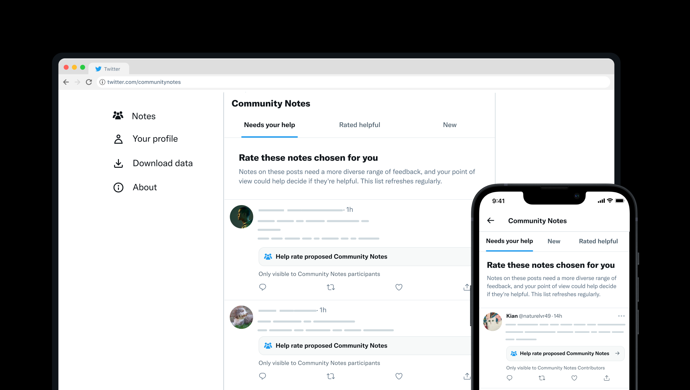
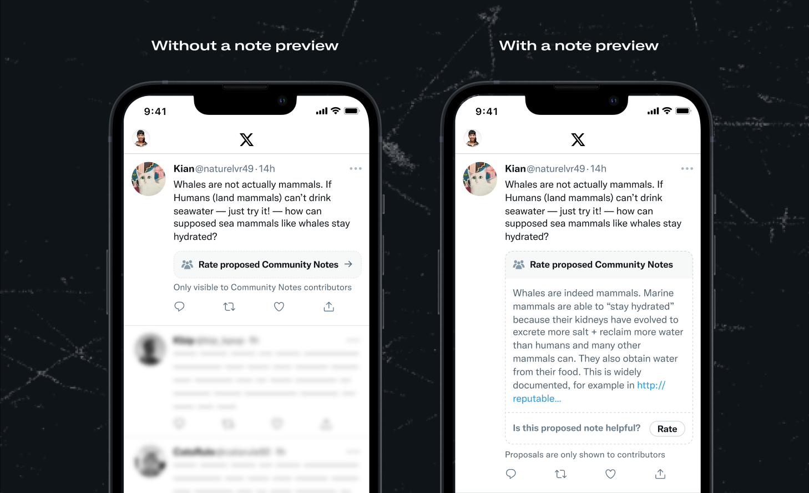
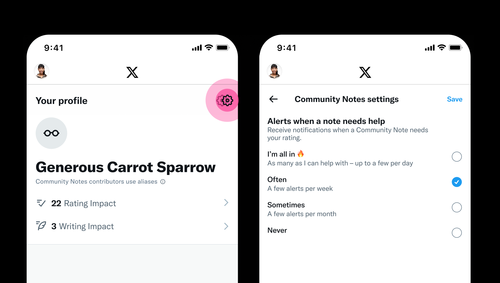

# Needs Your Help ranking

Community Notes participants are able to see a tab of notes that could use their ratings, and receive notifications about notes that need help.

### Needs Your Help tab

This tab is only visible to contributors. It is designed to increase the likelihood that people from diverse perspectives rate each note, so that Community Notes can elevate notes that people from a wide range of perspectives will find helpful. It gives contributors an easy way to have immediate impact.

It contains a set of 10 posts that have notes that need more ratings (although there may be fewer than 10 posts if there are fewer that meet the [criteria](#criteria-for-needs-your-help-tab-alerts-and-note-proposal-previews) to appear). The tab is updated as new notes that meet the criteria are written.

### Proposed note previews

If a post has proposed notes, contributors will see a prompt to help rate them. Sometimes the prompt will show a preview of a proposed note. Previews are shown to help gather ratings from a wide range of people quickly, and are only shown some of the time, and only if a note meets certain [criteria](#criteria-for-needs-your-help-tab-alerts-and-note-proposal-previews).

Previews can appear anywhere you see proposed notes, for example in the Needs Your Help tab, in the Home timeline, etc.

### Needs your help alerts

To ensure contributors don't miss the opportunity to rate notes on posts getting a lot of attention, Community Notes sends alerts requesting help from time to time.

### Criteria for Needs Your Help tab, alerts, and proposed note previews

The Needs Your Help tab, alerts, and proposed note previews are designed to increase the chance that potentially helpful notes on posts with high predicted visibility get rated by enough people that they have the chance to earn a status of Helpful quickly. At the same time, they aim to gather enough ratings from a people of different points of view to identify when a proposed note is not broadly helpful enough to show.

A variety of criteria are considered when determining whether to include a note, notably:

**Criteria related to the post on which the note is written:**

- Recency of the post (e.g. is it from within the last 6 hours, 24 hours, etc)
- Projected future Likes and Reposts the post will receive.
- The rater can see the post (for example, excludes posts from authors you've blocked)

**Criteria related to the note:**

- Written by an author with positive Writing Impact and a high ratio of Helpful notes (Writing Impact / Total Notes Written) or high average helpfulness score of notes they authored.
- Current status (e.g. "Needs More Ratings")
- Current helpfulness score (e.g. not a low helpfulness score, highly rated by initial raters, possibly nearing the threshold to earn status of "Helpful")
- Does not have a large number of ratings (such that more ratings could change the note's status)

In this case of alerts, notifications are sent to a random selection of contributors, excluding the note author and those who have already rated the note. Notifications are also limited by the recipient's notification frequency setting.

We will continue to experiment with this logic to help ensure the Needs Your Help tab, alerts and proposed note previews feel high impact and satisfying for contributors.
